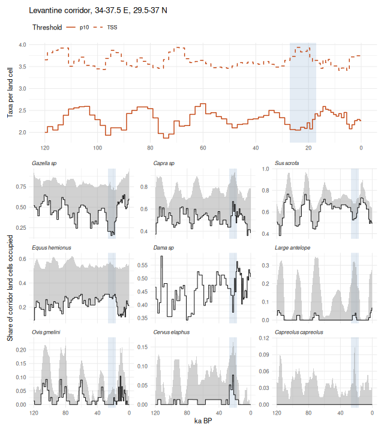
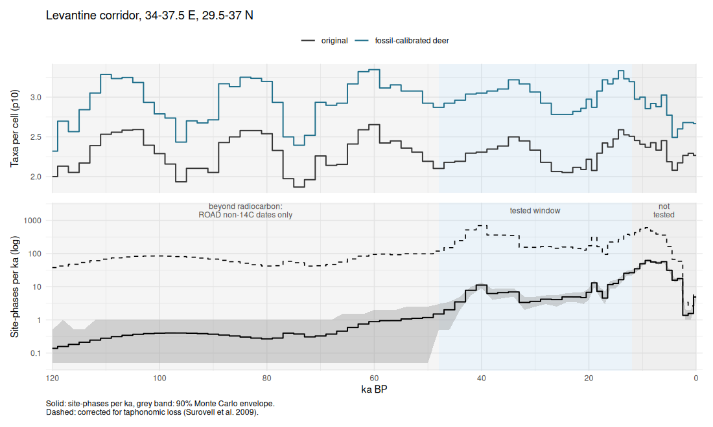
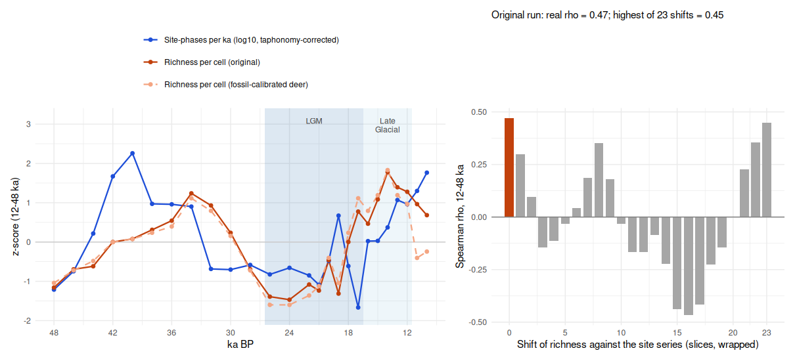

A complete analysis with the full pipeline: every bovid, cervid, equid and
wild boar on the Middle East's Pleistocene zooarchaeological list, modelled
against Beyer et al. (2020) palaeoclimate and hindcast across all 71 of its
slices back to 120 ka BP. Richness is read over the whole region and over the
Levantine corridor (34-37.5 E, 29.5-37 N), where it is compared with dated
archaeological site density.

**This vignette is precomputed.** It needs IUCN Red List range polygons,
which cannot be redistributed, and about 160 MB of prepared climate slices.
The code below is exactly what was run; `vignettes/precompute.R` re-renders
it from a local analysis folder. The model run is saved and keyed by the
species list, so editing the list and re-rendering fits only what changed.


``` r
library(richcast)
library(dplyr)
library(tidyr)
library(ggplot2)
packageVersion("richcast")
#> [1] '0.1.0'
```


``` r
# Paneled step plots: richness on top, one panel per taxon below. Bands are
# drawn as steps too; the top panel carries a Gaussian kernel smooth
# (bandwidth `bw` ka) over the middle of its band.
kernel_line <- function(d, bw = 10) {
  k <- stats::ksmooth(d$ka_bp, d$value, kernel = "normal", bandwidth = bw,
                      x.points = seq(min(d$ka_bp), max(d$ka_bp), by = 0.25))
  tibble(ka_bp = k$x, value = k$y)
}

# Expand points to step edges (half-way to each neighbour) so a ribbon
# follows the same steps as geom_step(direction = "mid"). The edges are
# nudged apart so no two rows share an x, which would otherwise let the
# ribbon cut diagonally across a step.
stepify <- function(d, eps = 1e-4) {
  d |>
    group_by(panel) |>
    arrange(ka_bp, .by_group = TRUE) |>
    mutate(left  = (ka_bp + lag(ka_bp, default = first(ka_bp))) / 2 + eps,
           right = (ka_bp + lead(ka_bp, default = last(ka_bp))) / 2 - eps) |>
    reframe(ka_bp = c(rbind(left, right)), lo = rep(lo, each = 2),
            hi = rep(hi, each = 2))
}

# Strict and lenient richness, each divided by its own median over the
# slices so the two cutoff rules share a scale.
relative_richness <- function(d) {
  d |>
    transmute(ka_bp, strict = strict / median(strict),
              lenient = lenient / median(lenient))
}

# The top panel: each rule's relative richness smoothed separately with a
# Gaussian kernel, the band spanning the two smoothed lines.
top_layers <- function(top, panel, bw) {
  sm <- tibble(
    ka_bp   = kernel_line(transmute(top, ka_bp, value = strict), bw)$ka_bp,
    strict  = kernel_line(transmute(top, ka_bp, value = strict), bw)$value,
    lenient = kernel_line(transmute(top, ka_bp, value = lenient), bw)$value,
    panel   = panel
  )
  lines <- sm |>
    pivot_longer(c(strict, lenient), names_to = "rule", values_to = "value") |>
    mutate(rule = factor(rule, c("strict", "lenient"),
                         c("strict (p10)", "lenient (TSS)")))
  list(
    geom_ribbon(data = sm, aes(ka_bp, ymin = pmin(strict, lenient),
                               ymax = pmax(strict, lenient)),
                inherit.aes = FALSE, fill = "steelblue", alpha = 0.3),
    geom_line(data = lines, aes(ka_bp, value, linetype = rule),
              inherit.aes = FALSE, colour = "steelblue4", linewidth = 0.8)
  )
}

panel_plot <- function(top, taxa, top_label, ylab, title, band_fill,
                       taxa_limits = c(0, 1), bw = 10, caption = NULL) {
  sp_order <- taxa |>
    group_by(panel) |>
    summarise(s = mean(value, na.rm = TRUE)) |>
    arrange(desc(s)) |>
    pull(panel)
  levs <- c(top_label, sp_order)
  taxa <- mutate(taxa, panel = factor(panel, levs))
  limits <- expand_grid(panel = factor(sp_order, levs), ka_bp = 0,
                        value = taxa_limits)
  bands <- stepify(filter(taxa, !is.na(lo), !is.na(hi)))

  ggplot(taxa, aes(ka_bp, value)) +
    geom_blank(data = limits) +
    top_layers(top, factor(top_label, levs), bw) +
    geom_ribbon(data = bands, aes(ka_bp, ymin = lo, ymax = hi),
                inherit.aes = FALSE, fill = band_fill, alpha = 0.35) +
    geom_step(direction = "mid", alpha = 0.55) +
    facet_wrap(~panel, ncol = 1, scales = "free_y", strip.position = "right",
               drop = FALSE) +
    scale_x_reverse() +
    scale_linetype_manual(values = c("solid", "dashed"), name = NULL) +
    labs(x = "ka BP", y = ylab, title = title,
         caption = paste0(caption, "\nTop lines: Gaussian kernel smooth of each rule, bandwidth ",
                          bw, " ka; the band spans the two.")) +
    theme_minimal() +
    theme(strip.text.y.right = element_text(angle = 0, hjust = 0,
                                            face = "italic"),
          panel.border = element_rect(fill = NA, colour = "grey75"),
          panel.spacing.y = unit(4, "pt"),
          plot.caption = element_text(hjust = 0),
          legend.position = "top")
}
```

## Species

Every species in an `UngulatePolygons` folder of IUCN downloads (bovids, cervids, equids,
wild boar),
keeping polygons coded extant and native or reintroduced, dissolved to one
range per species.


``` r
db <- build_taxon_db(iucn_folder("UngulatePolygons"),
                     quiet = TRUE)
# Only the names are shown: the polygons themselves are IUCN data, which may
# not be redistributed, even as printed coordinates.
nrow(db)
#> [1] 196
```

The region is the Middle East preset. The species modelled are those on the
bundled list of ungulates reported from Pleistocene zooarchaeological and
palaeontological sites in the region (Levant, Zagros, Syria, Arabia), with the
evidence and source for each. `?zooarch_taxa` gives the full references.


``` r
me <- region("middle_east")
me
zooarch_taxa(me) |> select(species, evidence, source)
#> # A tibble: 9 × 3
#>   species             evidence                                            source
#>   <chr>               <chr>                                               <chr> 
#> 1 Dama_sp             Fallow deer, the dominant prey at Qesem, Misliya, … Stine…
#> 2 Cervus_elaphus      Levant (Kebara, Hayonim, Qesem); Zagros (Ghar-e Bo… Stewa…
#> 3 Capreolus_capreolus Levant Middle Palaeolithic; Iran (Wezmeh, Kaldar)   Stewa…
#> 4 Gazella_sp          Gazelles: G. gazella dominant in the Levant (Misli… Yeshu…
#> 5 Large_antelope      Hartebeest at Hayonim, Geula B, El Wad and Skhul (… Grigg…
#> 6 Capra_sp            Wild goat dominates Levantine and Zagros caprines … Phill…
#> 7 Ovis_gmelini        Zagros (Kobeh, Shanidar; Ovis spp. at Wezmeh and Q… Stewa…
#> 8 Equus_hemionus      Levant; Arabia (Ti's al Ghadah, Empty Quarter, Shi… Stewa…
#> 9 Sus_scrofa          Levant Middle Palaeolithic (Qesem, Misliya, Hayoni… Stine…
```

Of those, only species whose present-day range lies within 10 degrees of the
region are trained:

### The species list

The list starts from the zooarchaeological defaults. **Edit it here**: add
species with `add` and drop them with `drop`, using IUCN binomials with an
underscore, e.g. `"Sus_scrofa"`. A changed list triggers a new model run
when the document is knitted; a list that has been run before reuses its
saved result.


``` r
add  <- c()   # e.g. c("Capra_ibex")
drop <- c()   # e.g. c("Capra_nubiana")

species <- setdiff(union(zooarch_taxa(me)$species, normalise_species(add)),
                   normalise_species(drop))
```

Species that are not reliably told apart in the zooarchaeological record
are one taxon each: fallow deer (`Dama_sp`), gazelles (`Gazella_sp`), wild
goat and ibex (`Capra_sp`), and hartebeest and oryx (`Large_antelope`). Each
member species is modelled on its own range, and the members are combined
afterwards: the taxon is present wherever any member is. (Modelling the
union of their ranges instead lets the largest range swamp the others.) The
groups come from the list's `members` column; edit `merges` to change them.


``` r
tx <- zooarch_taxa(me) |> filter(!is.na(members))
merges <- setNames(strsplit(tx$members, ";"), tx$species)
merges
#> $Dama_sp
#> [1] "Dama_dama"         "Dama_mesopotamica"
#> 
#> $Gazella_sp
#> [1] "Gazella_gazella"      "Gazella_subgutturosa" "Gazella_dorcas"      
#> 
#> $Large_antelope
#> [1] "Alcelaphus_buselaphus" "Oryx_leucoryx"        
#> 
#> $Capra_sp
#> [1] "Capra_aegagrus" "Capra_nubiana"
members <- lapply(setNames(species, species), \(t) merges[[t]] %||% t)
```

Species that are not in the range folder, or whose present range lies more
than 10 degrees from the region, cannot be trained:


``` r
all_members <- unique(unlist(members))
not_in_db <- setdiff(all_members, db$species)
too_far   <- setdiff(intersect(all_members, db$species),
                     species_near(db, me, quiet = TRUE))
not_in_db
#> character(0)
too_far
#> character(0)
usable <- setdiff(all_members, c(not_in_db, too_far))
included <- names(Filter(\(m) any(m %in% usable), members))
```

**Taxa included in the analysis** (9):


|taxon               |modelled_as                                             |evidence                                                                                                                                                                          |source                                                                                                   |
|:-------------------|:-------------------------------------------------------|:---------------------------------------------------------------------------------------------------------------------------------------------------------------------------------|:--------------------------------------------------------------------------------------------------------|
|Dama sp             |Dama dama + Dama mesopotamica                           |Fallow deer, the dominant prey at Qesem, Misliya, Kebara and Hayonim (Levant); reported as D. mesopotamica and D. dama                                                            |Stiner 2005; Yeshurun et al. 2007; Stiner et al. 2009; Davis 1974; Been et al. 2017; Stewart et al. 2019 |
|Cervus elaphus      |Cervus elaphus                                          |Levant (Kebara, Hayonim, Qesem); Zagros (Ghar-e Boof, Bisetun, Bawa Yawan); Iran                                                                                                  |Stewart et al. 2019; Mata-Gonzalez et al. 2023                                                           |
|Capreolus capreolus |Capreolus capreolus                                     |Levant Middle Palaeolithic; Iran (Wezmeh, Kaldar)                                                                                                                                 |Stewart et al. 2019; Mata-Gonzalez et al. 2023                                                           |
|Gazella sp          |Gazella gazella + Gazella subgutturosa + Gazella dorcas |Gazelles: G. gazella dominant in the Levant (Misliya, Kebara, Hayonim, Karaneh IV); G. subgutturosa at Umm el Tlel (Syria); G. dorcas in the terminal Pleistocene southern Levant |Yeshurun et al. 2007; Griggo 2004; Tsahar et al. 2009; Stewart et al. 2019                               |
|Large antelope      |Alcelaphus buselaphus + Oryx leucoryx                   |Hartebeest at Hayonim, Geula B, El Wad and Skhul (Levant); oryx at Umm el Tlel (Syria) and in the Empty Quarter                                                                   |Griggo 2004; McClure 1984; Stewart et al. 2019                                                           |
|Capra sp            |Capra aegagrus + Capra nubiana                          |Wild goat dominates Levantine and Zagros caprines (Kobeh, Shanidar, Ghar-e Boof, Kaldar, Wezmeh); ibex at Abu Noshra II and Nahal Aqev (reported as Capra ibex)                   |Phillips 1988; Rabinovich 2003; Stewart et al. 2019; Mata-Gonzalez et al. 2023                           |
|Ovis gmelini        |Ovis gmelini                                            |Zagros (Kobeh, Shanidar; Ovis spp. at Wezmeh and Qalehjough; reported as Ovis orientalis)                                                                                         |Stewart et al. 2019; Mata-Gonzalez et al. 2023                                                           |
|Equus hemionus      |Equus hemionus                                          |Levant; Arabia (Ti's al Ghadah, Empty Quarter, Shi'bat Dihya); Zagros (Wezmeh, Warwasi)                                                                                           |Stewart et al. 2019                                                                                      |
|Sus scrofa          |Sus scrofa                                              |Levant Middle Palaeolithic (Qesem, Misliya, Hayonim); Zagros (Ghar-e Boof); Jordan and Iran                                                                                       |Stiner 2005; Stiner et al. 2009; Stewart et al. 2019; Mata-Gonzalez et al. 2023                          |


## Climate

Beyer et al. (2020) at its native 0.5 degrees: the 0 BP slice for fitting,
and every published slice back to 120 ka BP for projection (1 ka steps to
22 ka, 2 ka steps beyond). Slices are prepared globally, so no species' study
extent is truncated. `prepare_climate()` skips slices already on disk.


``` r
steps_bp <- pastclim::get_time_bp_steps(dataset = "Beyer2020")
times_ce <- bp_to_ce(steps_bp[steps_bp < 0])
length(times_ce)
#> [1] 71

clim <- prepare_climate(
  "beyer",
  times        = times_ce,
  extent       = c(-180, 180, -60, 90),
  dataset_past = "Beyer2020",
  agg_past     = 1,
  present_dir  = "beyer_1950",
  quiet        = TRUE
)
clim
bioclim_vars
#> [1] "bio01" "bio04" "bio05" "bio06" "bio12" "bio15" "bio16" "bio17"
```

## The run

`run_hindcast_series()` uses the zooarchaeological list by default. Each
species: study extent of its range's bounding box plus 30% of the
diagonal, 100 pseudo-presences inside the polygon and 1000 background points,
a random forest + MaxEnt ensemble, the p10 threshold, and AUC and Boyce on a
25% hold-out. The run's result is saved and reused when this document is
re-knitted.


``` r
# One saved run per species list, so editing the list and knitting again
# never reuses a result fitted on different species.
run_file <- file.path("runs", paste0("res_", rlang::hash(list(sort(included), merges)), ".rds"))
if (file.exists(run_file)) {
  res <- readRDS(run_file)
} else {
  res <- run_hindcast_series(db, clim, times = times_ce, region = me,
                             species = included, merge = merges, quiet = TRUE)
  dir.create("runs", showWarnings = FALSE)
  saveRDS(res, run_file)
}
run_file
#> [1] "runs/res_3306b1f557eac13ab447839e559c5022.rds"
res
```

Species that were usable but could not be fitted:


``` r
setdiff(usable, names(res$fits))
#> character(0)
```

### Presence thresholds

Presence is read as a band rather than a line. The strict edge is each
model's p10 threshold, used throughout the run. The lenient edge is the
threshold that maximises the true skill statistic (TSS), treating cells
inside the species' present range polygon as presences and the rest of its
study extent as absences. For every species here it falls at or below p10, so
suitability between the two reads as possible but marginal presence. The
minimum-presence threshold (lowest suitability anywhere inside the range) is
listed too, but for wide-ranging species it falls close to zero, set by a
few ragged edge cells, so it is not used for the band.


``` r
thr <- presence_thresholds(res, db)
thr |> mutate(across(where(is.double), \(x) round(x, 3)))
#> # A tibble: 14 × 4
#>    species               threshold min_presence   tss
#>    <chr>                     <dbl>        <dbl> <dbl>
#>  1 Dama_dama                 0.557        0.427 0.427
#>  2 Dama_mesopotamica         0.56         0.34  0.559
#>  3 Cervus_elaphus            0.583        0.004 0.322
#>  4 Capreolus_capreolus       0.591        0.001 0.203
#>  5 Gazella_gazella           0.516        0.388 0.38 
#>  6 Gazella_subgutturosa      0.511        0.006 0.249
#>  7 Gazella_dorcas            0.498        0.036 0.399
#>  8 Alcelaphus_buselaphus     0.57         0.053 0.343
#>  9 Oryx_leucoryx             0.722        0.668 0.661
#> 10 Capra_aegagrus            0.578        0.05  0.282
#> 11 Capra_nubiana             0.547        0.134 0.379
#> 12 Ovis_gmelini              0.509        0.143 0.361
#> 13 Equus_hemionus            0.559        0.176 0.278
#> 14 Sus_scrofa                0.482        0.03  0.332

taxon_of <- unlist(lapply(names(res$taxa), \(t) setNames(rep(t, length(res$taxa[[t]])), res$taxa[[t]])))
thr <- thr |> mutate(taxon = taxon_of[species])
```

Cell-level suitability for every fitted species over the region is computed
once per slice and saved next to the run. Every sub-area below, such as the
Levantine corridor, is read from this region table.


``` r
slice_keys <- c("present", as.character(times_ce))
to_ka <- function(t) ifelse(t == "present", 0, -ce_to_bp(suppressWarnings(as.numeric(t))) / 1000)

# Per cell and taxon: strict presence (any member above p10), lenient presence
# (any member above TSS), and the suitability and thresholds of the member
# furthest above its p10 threshold.
by_taxon <- function(g) {
  g |>
    filter(!is.na(suitability)) |>
    left_join(select(thr, species, taxon, tss), by = "species") |>
    group_by(x, y, taxon) |>
    summarise(strict  = any(suitability > threshold),
              lenient = any(suitability > tss),
              best    = which.max(suitability - threshold),
              suit    = suitability[best], p10 = threshold[best],
              tss     = tss[best], .groups = "drop") |>
    select(-best)
}

cells_file <- sub("\\.rds$", "_cells.rds", run_file)
if (file.exists(cells_file)) {
  cell_tbl <- readRDS(cells_file)
} else {
  cell_tbl <- lapply(slice_keys, function(k) {
    reg <- suitability_grid(res, me, k, clim)
    list(region = by_taxon(reg), region_cells = attr(reg, "cells"))
  })
  names(cell_tbl) <- slice_keys
  saveRDS(cell_tbl, cells_file)
}
```

## Model performance

AUC and continuous Boyce index on the hold-out, for each member and for the
ensemble.


``` r
res$models |>
  select(starts_with("auc_"), starts_with("boyce_")) |>
  pivot_longer(everything(), names_to = c("metric", "model"),
               names_sep = "_") |>
  group_by(metric, model) |>
  summarise(median = median(value, na.rm = TRUE),
            q25 = quantile(value, 0.25, na.rm = TRUE),
            q75 = quantile(value, 0.75, na.rm = TRUE),
            min = min(value, na.rm = TRUE), .groups = "drop") |>
  mutate(across(where(is.numeric), \(x) round(x, 3)))
#> # A tibble: 6 × 6
#>   metric model    median   q25   q75    min
#>   <chr>  <chr>     <dbl> <dbl> <dbl>  <dbl>
#> 1 auc    ensemble  0.947 0.899 0.962  0.789
#> 2 auc    maxent    0.943 0.893 0.95   0.843
#> 3 auc    rf        0.939 0.899 0.961  0.771
#> 4 boyce  ensemble  0.827 0.655 0.914  0.137
#> 5 boyce  maxent    0.79  0.684 0.843  0.111
#> 6 boyce  rf        0.79  0.581 0.861 -0.034
```


``` r
res$models |>
  select(species, starts_with("auc_"), starts_with("boyce_")) |>
  pivot_longer(-species, names_to = c("metric", "model"), names_sep = "_") |>
  mutate(model = factor(model, c("maxent", "rf", "ensemble")),
         metric = toupper(metric)) |>
  ggplot(aes(model, value)) +
  geom_boxplot(outlier.shape = NA, fill = "grey90") +
  geom_jitter(width = 0.15, alpha = 0.4, size = 1) +
  facet_wrap(~metric, scales = "free_y") +
  labs(x = NULL, y = NULL) +
  theme_minimal()
```


Per species:


``` r
res$models |>
  mutate(across(where(is.double), \(x) round(x, 3))) |>
  arrange(desc(auc_ensemble))
#> # A tibble: 14 × 13
#>    species     taxon range_cells n_presence n_background threshold present_cells
#>    <chr>       <chr>       <int>      <int>        <int>     <dbl>         <int>
#>  1 Capreolus_… Capr…        3615        100         1000     0.591          2917
#>  2 Gazella_su… Gaze…        3291        100         1000     0.511          3207
#>  3 Oryx_leuco… Larg…          24         24         1000     0.722           165
#>  4 Equus_hemi… Equu…         382        100         1000     0.559          2061
#>  5 Gazella_do… Gaze…        3649        100         1000     0.498          3292
#>  6 Sus_scrofa  Sus_…       12704        100         1000     0.482         11498
#>  7 Cervus_ela… Cerv…        2475        100         1000     0.583          2673
#>  8 Ovis_gmeli… Ovis…         166        100         1000     0.509           371
#>  9 Capra_aega… Capr…         747        100         1000     0.578          1133
#> 10 Capra_nubi… Capr…         142        100         1000     0.547           446
#> 11 Dama_dama   Dama…         119        100         1000     0.557           225
#> 12 Gazella_ga… Gaze…          18         18          172     0.516            22
#> 13 Alcelaphus… Larg…        2673        100         1000     0.57           2967
#> 14 Dama_mesop… Dama…          11         11         1000     0.56            201
#> # ℹ 6 more variables: auc_maxent <dbl>, boyce_maxent <dbl>, auc_rf <dbl>,
#> #   boyce_rf <dbl>, auc_ensemble <dbl>, boyce_ensemble <dbl>
```

## Regional richness through time

Per slice, over the region's land cells: `strict` is the mean number of taxa
per cell above their p10 threshold, and `lenient` the mean above their TSS
threshold. Summing the suitabilities instead would not give a richness: they
are not calibrated probabilities of presence, so the p10 and TSS counts are
read as the bounds of a band.


``` r
rich <- bind_rows(lapply(slice_keys, function(k) {
  ct <- cell_tbl[[k]]
  per_cell <- ct$region |>
    group_by(x, y) |>
    summarise(strict = sum(strict), lenient = sum(lenient), .groups = "drop")
  tibble(time = k, ka_bp = to_ka(k), cells = ct$region_cells,
         strict = mean(per_cell$strict), lenient = mean(per_cell$lenient))
}))
rich |>
  select(ka_bp, cells, strict, lenient) |>
  mutate(across(c(strict, lenient), \(x) round(x, 2)))
#> # A tibble: 72 × 4
#>    ka_bp cells strict lenient
#>    <dbl> <int>  <dbl>   <dbl>
#>  1     0  3489   1.55    2.25
#>  2   120  3521   1.52    2.26
#>  3   118  3551   1.36    2.2 
#>  4   116  3590   1.35    2.21
#>  5   114  3604   1.51    2.34
#>  6   112  3632   1.69    2.49
#>  7   110  3633   1.54    2.36
#>  8   108  3631   1.56    2.27
#>  9   106  3620   1.55    2.38
#> 10   104  3601   1.64    2.5 
#> # ℹ 62 more rows
```

Top panel: mean richness as a band between the strict (p10) and lenient (TSS)
counts. Each count is first divided by its own median across all slices, so
the two rules are put on one scale: 1 is that rule's typical richness, 1.1 is
10% above it. Each rule is then smoothed with a Gaussian kernel (solid:
strict, dashed: lenient), and the band spans the two smoothed lines. Below: the share of the region's land cells each taxon occupies,
the line at the strict threshold and the band reaching up to the lenient one.


``` r
occupancy <- bind_rows(lapply(slice_keys, function(k) {
  cell_tbl[[k]]$region |>
    group_by(taxon) |>
    summarise(value = sum(strict), hi = sum(lenient), .groups = "drop") |>
    mutate(ka_bp = to_ka(k), value = value / cell_tbl[[k]]$region_cells,
           hi = hi / cell_tbl[[k]]$region_cells, lo = value)
})) |>
  transmute(ka_bp, value, lo, hi, panel = gsub("_", " ", taxon))

panel_plot(
  top   = rich |> relative_richness(),
  taxa  = occupancy,
  top_label = "Relative richness",
  ylab  = "Relative richness (top) / share of region occupied",
  title = "Middle East",
  band_fill = "grey40",
  taxa_limits = c(0, NA),
  caption = "Top: strict (p10) and lenient (TSS) mean richness per cell, each divided by its own median.\nTaxon bands: strict to lenient share occupied."
)
```


### Maps

Colour classes are the quartiles of richness over every cell of every
slice, so a colour means the same thing in every panel. Richness is a small
integer, so quartile breaks that coincide are merged, which can leave fewer
than four classes.


``` r
all_cells <- richness_grid(res, times = c("present", as.character(res$times)))
breaks <- unique(quantile(all_cells$richness, probs = seq(0, 1, 0.25)))
breaks
#> [1] 0 1 3 5
classes <- cut(all_cells$richness, breaks, include.lowest = TRUE,
               dig.lab = 3)
class_levels <- levels(classes)

show_bp <- c(0, 6000, 12000, 21000, 60000, 120000)
keys <- ifelse(show_bp == 0, "present", as.character(bp_to_ce(-show_bp)))
grid <- richness_grid(res, times = keys) |>
  mutate(ka_bp = ifelse(time == "present", 0, -ce_to_bp(as.numeric(time)) / 1000),
         label = factor(paste(ka_bp, "ka BP"), paste(show_bp / 1000, "ka BP")),
         class = factor(cut(richness, breaks, include.lowest = TRUE, dig.lab = 3),
                        levels = class_levels))

coast <- sf::st_crop(sf::st_as_sf(rnaturalearth::ne_coastline(50, returnclass = "sf")),
                     xmin = me$box[1], xmax = me$box[2],
                     ymin = me$box[3], ymax = me$box[4])

ggplot(grid) +
  geom_raster(aes(x, y, fill = class)) +
  geom_sf(data = coast, linewidth = 0.2, colour = "grey30") +
  scale_fill_viridis_d(option = "magma", direction = -1, drop = FALSE,
                       end = 0.9) +
  facet_wrap(~label, ncol = 3) +
  coord_sf(expand = FALSE) +
  labs(x = NULL, y = NULL, fill = "Species\n(quartile class)") +
  theme_minimal()
```


## The Levantine corridor

The corridor runs from the Negev and the head of the Gulf of Aqaba north to
Hatay: 34.0-37.5 E by 29.5-37.0 N, 75-78 land cells depending on sea level.
Its richness is the mean number of taxa per land cell, at each threshold, read
from the region's cell table. Counting a taxon wherever it clears its
threshold in any one cell does not work at this size: over about 77 cells
nearly every taxon turns up somewhere, so that count saturates.


``` r
corridor <- c(34.0, 37.5, 29.5, 37.0)
in_corridor <- function(d) {
  filter(d, x > corridor[1], x < corridor[2], y > corridor[3], y < corridor[4])
}
corridor_richness <- function(cells) {
  bind_rows(lapply(names(cells), function(k) {
    in_corridor(cells[[k]]$region) |>
      group_by(x, y) |>
      summarise(strict = sum(strict), lenient = sum(lenient), .groups = "drop") |>
      summarise(cells = n(), strict = mean(strict), lenient = mean(lenient)) |>
      mutate(ka_bp = to_ka(k))
  }))
}
corr_rich <- corridor_richness(cell_tbl)
corr_share <- bind_rows(lapply(slice_keys, function(k) {
  d <- in_corridor(cell_tbl[[k]]$region)
  n <- nrow(distinct(d, x, y))
  d |>
    group_by(taxon) |>
    summarise(p10 = sum(strict) / n, tss = sum(lenient) / n, .groups = "drop") |>
    mutate(ka_bp = to_ka(k))
}))
corr_rich |>
  summarise(cells = paste(range(cells), collapse = "-"),
            across(c(strict, lenient), list(mean = mean, min = min, max = max))) |>
  mutate(across(where(is.double), \(x) round(x, 2)))
#> # A tibble: 1 × 7
#>   cells strict_mean strict_min strict_max lenient_mean lenient_min lenient_max
#>   <chr>       <dbl>      <dbl>      <dbl>        <dbl>       <dbl>       <dbl>
#> 1 75-78         2.3       1.87       2.65         3.63        3.41        3.94
```

Top: mean taxa per land cell at the p10 (solid) and TSS (dashed) thresholds.
Below: the share of the corridor's land cells each taxon occupies, the line
at p10 and the band reaching up to TSS. The blue band marks the Last Glacial
Maximum (17-27 ka).


``` r
lgm <- annotate("rect", xmin = 17, xmax = 27, ymin = -Inf, ymax = Inf,
                fill = "#2166ac", alpha = 0.12)
p_cr <- corr_rich |>
  pivot_longer(c(strict, lenient), names_to = "rule", values_to = "taxa") |>
  mutate(rule = factor(rule, c("strict", "lenient"), c("p10", "TSS"))) |>
  ggplot(aes(ka_bp, taxa, linetype = rule)) +
  lgm +
  geom_step(direction = "mid", colour = "#c2410c", linewidth = 0.6) +
  scale_x_reverse(breaks = seq(0, 120, 20)) +
  scale_linetype_manual(values = c(p10 = "solid", TSS = "dashed"), name = "Threshold") +
  labs(x = NULL, y = "Taxa per land cell",
       title = "Levantine corridor, 34-37.5 E, 29.5-37 N") +
  theme_minimal(base_size = 10) +
  theme(legend.position = "top", legend.justification = "left")
p_cs <- corr_share |>
  mutate(taxon = gsub("_", " ", taxon)) |>
  group_by(taxon) |> mutate(ord = mean(tss)) |> ungroup() |>
  mutate(taxon = reorder(taxon, -ord)) |>
  ggplot(aes(ka_bp)) +
  lgm +
  geom_ribbon(aes(ymin = p10, ymax = tss), fill = "grey60", alpha = 0.45) +
  geom_step(aes(y = p10), direction = "mid", linewidth = 0.4) +
  facet_wrap(~taxon, ncol = 3, scales = "free_y") +
  scale_x_reverse(breaks = seq(0, 120, 40)) +
  labs(x = "ka BP", y = "Share of corridor land cells occupied") +
  theme_minimal(base_size = 10) +
  theme(strip.text = element_text(face = "italic", hjust = 0))
patchwork::wrap_plots(p_cr, p_cs, ncol = 1, heights = c(1, 2.4))
```



## Archaeological site density in the Levantine corridor

Does modelled ungulate richness track how intensively people used the
landscape? This section compares corridor richness at the p10 threshold with a
time series of dated archaeological site-phases from the same box.

### The site series

The series ships with richcast as `levant_site_series.csv` in `extdata`. It is
an aggregate, one row per richcast slice; no individual dates are included.
It was built outside the package, by a separate Python pipeline:

* **Dates.** Radiocarbon dates from p3k14c (Bird et al. 2022), restricted to
  the Middle East, with flagged dates and duplicates dropped. Absolute dates
  from ROAD (Kandel et al. 2023, via roadDB): radiocarbon, OSL, TL, ESR,
  U-series and others. Radiocarbon dates already in ROAD were dropped from
  p3k14c. Only sites inside the corridor box were kept. NERD (Palmisano et al.
  2022) is left out: it covers only 15-1.5 ka, so it would add 25-50% more
  phases exactly where the curve rises (17-12 ka) and make the 14C coverage
  uneven across the tested window.
* **Calibration.** Radiocarbon dates were calibrated with IntCal20 (Reimer
  et al. 2020); other methods were taken as normal distributions with their
  reported 1-sigma error.
* **Site-phases.** Dates were grouped into site-phases: one per dated layer
  for ROAD, and bins of 200 years (`rcarbon::binPrep`, `h = 200`) for the
  radiocarbon dates. Each phase's mean age distribution was integrated
  over each slice's window (half-way to the neighbouring slices) and summed
  over phases. That gives the expected number of phases per slice
  (`levant_phases`), and per ka once divided by the window width
  (`levant_per_ka`).
* **Uncertainty.** `levant_per_ka_q05` and `levant_per_ka_q95` are the 90%
  envelope of 500 Monte Carlo draws of one age per phase.
* **Taphonomy.** `levant_per_ka_taph` is corrected for the loss of older
  deposits with the Surovell et al. (2009) model,
  n(t) = 5.726442e6 (t + 2176.4)^-1.3925, relative to the present.

Before 48 ka, beyond radiocarbon, only ROAD's other dating methods
contribute, so the series there is sparse and coarse.

Without NERD the Holocene is thinly covered (ROAD ends near 20 ka, and
p3k14c is sparse for the late Holocene Levant), so 0-12 ka is shown for
context but not tested.

**Licence and attribution.** `levant_site_series.csv` is derived from ROAD
(CC BY-SA 4.0) and p3k14c (data CC0, attribution requested), and is
distributed under **CC BY-SA 4.0**. If you use it, cite Kandel et al. (2023),
Bird et al. (2022), Reimer et al. (2020) and Surovell et al. (2009).


``` r
sites <- read.csv(system.file("extdata", "levant_site_series.csv",
                              package = "richcast"))
head(sites)
#>   ka_bp levant_phases levant_per_ka levant_per_ka_taph levant_per_ka_q05
#> 1     0        2.4418        4.8836             5.6820                 4
#> 2     1        1.5580        1.5580             2.6377                 1
#> 3     2        1.3700        1.3700             3.3953                 1
#> 4     3       17.5691       17.5691            58.7128                16
#> 5     4       15.7250       15.7250            67.2030                13
#> 6     5       31.2472       31.2472           164.5737                28
#>   levant_per_ka_q95
#> 1              6.00
#> 2              2.00
#> 3              2.05
#> 4             19.00
#> 5             18.00
#> 6             35.00
```

### Richness in the corridor

The comparison uses p10 richness from the corridor section above. It is also
drawn for the fossil-calibrated run, where red deer and roe deer also train on
dated ROAD occurrences (see "Fossil presences" in `?fit_sdm`), when that run
has been saved next to this one. The fossil table itself is not distributed.


``` r
corr <- corr_rich |> transmute(ka_bp, cells, richness = strict, run = "original")

# The fossil-calibrated run, if it has been saved alongside this one: same
# species and merges, plus the deer fossil table and 100 draws.
fossil_csv <- "deer_fossil_presences.csv"
if (file.exists(fossil_csv)) {
  fos <- fossil_presences(fossil_csv)
  key <- c(list(sort(included), merges), list(as.data.frame(fos), 100))
  f_cells <- file.path("runs", paste0("res_", rlang::hash(key), "_cells.rds"))
  if (file.exists(f_cells)) {
    corr <- bind_rows(corr, corridor_richness(readRDS(f_cells)) |>
                        transmute(ka_bp, cells, richness = strict,
                                  run = "fossil-calibrated deer"))
  }
}
corr <- corr |> mutate(run = factor(run, c("original", "fossil-calibrated deer")))
corr |>
  group_by(run) |>
  summarise(cells = paste(range(cells), collapse = "-"),
            mean = mean(richness), min = min(richness), max = max(richness))
#> # A tibble: 2 × 5
#>   run                    cells  mean   min   max
#>   <fct>                  <chr> <dbl> <dbl> <dbl>
#> 1 original               75-78  2.30  1.87  2.65
#> 2 fossil-calibrated deer 75-78  2.95  2.32  3.35
```

### Do they co-vary?

For each window, the Spearman correlation between the taphonomy-corrected
site-phases per ka and richness per cell. Both series are strongly
autocorrelated, so the significance test is a **circular shift**: richness is
rolled against the site series by every lag from 1 to n - 1, wrapping around
at the ends, and p is the share of lags whose |rho| is at least the observed
one. This keeps each series' own autocorrelation and asks only whether the
two line up better than at a random offset. When no lag does as well, p is
reported as below 1/(n - 1). The Spearman correlation of first differences
(slice-to-slice changes) asks whether the two also move together step by
step, or only share a slow trend. The accompanying paper tests the same
comparison against IAAFT surrogates, on 1 and 2 ka slices, with and without
NERD and the taphonomic correction, and at both thresholds; those results are
in its supplementary tables.


``` r
shift_test <- function(x, y) {
  n <- length(x)
  obs <- cor(x, y, method = "spearman")
  lagged <- vapply(seq_len(n - 1), function(k) {
    cor(x, y[c((k + 1):n, seq_len(k))], method = "spearman")
  }, numeric(1))
  tibble(n = n, rho = obs, p_shift = mean(abs(lagged) >= abs(obs)),
         p_floor = 1 / (n - 1),
         diff_rho = cor(diff(x), diff(y), method = "spearman"))
}
windows <- list("0-12" = c(0, 12), "12-48" = c(12, 48), "48-120" = c(48, 120),
                "12-120" = c(12, 120), "0-120" = c(0, 120))
joined <- inner_join(corr, sites, by = "ka_bp")
tests <- bind_rows(lapply(names(windows), function(w) {
  bind_rows(lapply(split(joined, joined$run, drop = TRUE), function(d) {
    d <- filter(d, ka_bp >= windows[[w]][1], ka_bp <= windows[[w]][2]) |> arrange(ka_bp)
    shift_test(d$levant_per_ka_taph, d$richness) |>
      mutate(run = as.character(d$run[1]), window_ka = w, .before = 1)
  }))
}))
tests |>
  mutate(p_shift = ifelse(p_shift == 0, sprintf("< %.3f", p_floor),
                          sprintf("%.2f", p_shift)),
         across(c(rho, diff_rho), \(x) sprintf("%.2f", x))) |>
  select(-p_floor)
#> # A tibble: 10 × 6
#>    run                    window_ka     n rho   p_shift diff_rho
#>    <chr>                  <chr>     <int> <chr> <chr>   <chr>   
#>  1 original               0-12         13 0.59  0.42    0.13    
#>  2 fossil-calibrated deer 0-12         13 0.64  0.33    0.10    
#>  3 original               12-48        24 0.47  < 0.043 -0.14   
#>  4 fossil-calibrated deer 12-48        24 0.43  0.13    -0.12   
#>  5 original               48-120       37 0.24  0.47    0.04    
#>  6 fossil-calibrated deer 48-120       37 0.24  0.42    -0.01   
#>  7 original               12-120       60 0.15  0.20    -0.03   
#>  8 fossil-calibrated deer 12-120       60 0.26  < 0.017 -0.05   
#>  9 original               0-120        72 0.23  0.18    -0.04   
#> 10 fossil-calibrated deer 0-120        72 0.30  0.27    -0.07
```

The full 120 ka series first: corridor richness for both runs, and the site
curve with its uncertainty.


``` r
shade <- tibble(xmin = c(12, 48, 0), xmax = c(48, 120, 12),
                label = c("tested window", "beyond radiocarbon:\nROAD non-14C dates only",
                          "not\ntested"),
                fill = c("#0072B2", "grey50", "grey20"))
run_cols <- c("original" = "grey20", "fossil-calibrated deer" = "#1f6f8b")

p_rich <- ggplot(corr, aes(ka_bp, richness, colour = run)) +
  geom_rect(data = shade, aes(xmin = xmin, xmax = xmax, ymin = -Inf, ymax = Inf),
            inherit.aes = FALSE, fill = shade$fill, alpha = 0.08) +
  geom_step(direction = "mid", linewidth = 0.6) +
  scale_x_reverse(breaks = seq(0, 120, 20), expand = c(0.01, 0)) +
  scale_colour_manual(values = run_cols, name = NULL) +
  labs(x = NULL, y = "Taxa per cell (p10)",
       title = "Levantine corridor, 34-37.5 E, 29.5-37 N") +
  theme_minimal(base_size = 10) +
  theme(legend.position = "top", axis.text.x = element_blank())

p_sites <- ggplot(sites, aes(ka_bp)) +
  geom_rect(data = shade, aes(xmin = xmin, xmax = xmax, ymin = 0, ymax = Inf),
            inherit.aes = FALSE, fill = shade$fill, alpha = 0.08) +
  geom_text(data = shade, aes(x = (xmin + xmax) / 2, y = 2000, label = label),
            inherit.aes = FALSE, size = 2.8, colour = "grey30", lineheight = 0.9) +
  geom_ribbon(aes(ymin = pmax(levant_per_ka_q05, 0.05), ymax = pmax(levant_per_ka_q95, 0.05)),
              fill = "grey60", alpha = 0.4) +
  geom_step(aes(y = levant_per_ka), direction = "mid", linewidth = 0.6) +
  geom_step(aes(y = levant_per_ka_taph), direction = "mid", linetype = "dashed",
            linewidth = 0.5) +
  scale_x_reverse(breaks = seq(0, 120, 20), expand = c(0.01, 0)) +
  scale_y_log10(labels = \(x) format(x, scientific = FALSE, drop0trailing = TRUE)) +
  labs(x = "ka BP", y = "Site-phases per ka (log)",
       caption = "Solid: site-phases per ka, grey band: 90% Monte Carlo envelope.\nDashed: corrected for taphonomic loss (Surovell et al. 2009).") +
  theme_minimal(base_size = 10) +
  theme(plot.caption = element_text(hjust = 0))

patchwork::wrap_plots(p_rich, p_sites, ncol = 1, heights = c(1, 1.3))
```



Then the comparison itself, for the original run, with the fossil-calibrated
run as a secondary line when it is available. Left: the series from 48 to 10
ka on one axis, each as a z-score over the 48-12 ka test window. Right: the
circular-shift test drawn out for the original run, the 12-48 ka correlation
at the real alignment (orange) and with richness rolled by each of the other
23 slices (grey).


``` r
main_run <- "original"
second_run <- "fossil-calibrated deer"
win <- joined |> filter(ka_bp >= 12, ka_bp <= 48)
z_of <- function(v, ref) (v - mean(ref)) / sd(ref)

site_w <- win |> filter(run == main_run)
ov <- joined |>
  filter(run == main_run, ka_bp >= 10, ka_bp <= 48) |>
  transmute(ka_bp, value = z_of(log10(levant_per_ka_taph), log10(site_w$levant_per_ka_taph)),
            series = "Site-phases per ka (log10, taphonomy-corrected)")
for (r in intersect(c(main_run, second_run), as.character(unique(joined$run)))) {
  rw <- win |> filter(run == r)
  ov <- bind_rows(ov, joined |>
    filter(run == r, ka_bp >= 10, ka_bp <= 48) |>
    transmute(ka_bp, value = z_of(richness, rw$richness),
              series = paste0("Richness per cell (", r, ")")))
}
lev <- c("Site-phases per ka (log10, taphonomy-corrected)",
         "Richness per cell (original)", "Richness per cell (fossil-calibrated deer)")
ov <- ov |> mutate(series = factor(series, intersect(lev, unique(series))))
ov_cols <- setNames(c("#1d4ed8", "#c2410c", "#f4a582"), lev)
ov_lt <- setNames(c("solid", "solid", "dashed"), lev)
bands <- tibble(xmin = c(11.5, 16.5), xmax = c(16.5, 26.5),
                label = c("Late\nGlacial", "LGM"), fill = c("#92c5de", "#2166ac"))
z_lim <- range(ov$value) + c(-0.2, 0.9)

p_ov <- ggplot(ov, aes(ka_bp, value, colour = series, linetype = series)) +
  geom_rect(data = bands, aes(xmin = xmin, xmax = xmax, ymin = -Inf, ymax = Inf),
            inherit.aes = FALSE, fill = bands$fill, alpha = 0.15) +
  geom_text(data = bands, aes(x = (xmin + xmax) / 2, y = z_lim[2], label = label),
            inherit.aes = FALSE, vjust = 1, size = 2.8, colour = "grey25", lineheight = 0.9) +
  geom_hline(yintercept = 0, colour = "grey80") +
  geom_line(linewidth = 0.7) +
  geom_point(size = 1.5) +
  scale_x_reverse(breaks = seq(12, 48, 6)) +
  scale_y_continuous(limits = z_lim) +
  scale_colour_manual(values = ov_cols, name = NULL) +
  scale_linetype_manual(values = ov_lt, name = NULL) +
  labs(x = "ka BP", y = "z-score (12-48 ka)") +
  guides(colour = guide_legend(ncol = 1)) +
  theme_minimal(base_size = 10) +
  theme(legend.position = "top")

w <- win |> filter(run == main_run) |> arrange(ka_bp)
n <- nrow(w)
shift_rho <- tibble(k = 0:(n - 1)) |>
  mutate(rho = vapply(k, function(kk) {
    y <- if (kk == 0) w$richness else w$richness[c((kk + 1):n, seq_len(kk))]
    cor(w$levant_per_ka_taph, y, method = "spearman")
  }, numeric(1)),
  real = k == 0)
best <- max(shift_rho$rho[!shift_rho$real])

p_bar <- ggplot(shift_rho, aes(k, rho, fill = real)) +
  geom_col(width = 0.8) +
  geom_hline(yintercept = 0, colour = "grey50") +
  scale_fill_manual(values = c(`TRUE` = "#c2410c", `FALSE` = "grey65"), guide = "none") +
  scale_x_continuous(breaks = c(0, 5, 10, 15, 20, n - 1)) +
  labs(x = "Shift of richness against the site series (slices, wrapped)",
       y = "Spearman rho, 12-48 ka",
       title = sprintf("Original run: real rho = %.2f; highest of %d shifts = %.2f",
                       shift_rho$rho[1], n - 1, best)) +
  theme_minimal(base_size = 10) +
  theme(plot.title = element_text(size = 10))

patchwork::wrap_plots(p_ov, p_bar, widths = c(1.4, 1))
```




### Reading it

From 48 to 12 ka, in the original run, corridor richness at p10 and
site density are correlated (Spearman rho 0.47,
circular-shift p below 0.043; first differences
-0.14). The real alignment beats every shift, but
only narrowly: shifting richness by one slice gives rho
0.45 and 0.30, and the highest
of the 23 shifts is 0.45. So whatever the two share
is a slow trend, not slice-by-slice coupling. The fossil-calibrated run
gives rho 0.43 (p 0.13): its deer add a
nearly constant amount to the corridor, so the ranks barely move. Its red deer
and roe deer were also trained on dated ROAD occurrences, part of the same
record the site curve counts, so the original run is the fair test.

Beyond 48 ka there is no relation (rho 0.24, p
0.47): with radiocarbon out of reach, the site series rests on a
handful of coarsely dated layers. The Holocene is not tested, as the site
series covers it unevenly.

The correlation also depends on the presence threshold: the corridor
section shows that richness at TSS rises at the LGM where p10 richness falls,
and the paper's supplementary tables find no association at TSS. Read the p10
result as one end of the band, not as evidence that people followed prey
diversity.

## Caveats

* The models assume niche conservatism, and the deep slices ask them to
  extrapolate furthest from the climate they were fitted on.
* Pseudo-presences come from IUCN polygons, so the models learn today's
  mapped range, including any part of it shaped by people rather than
  climate.
* The species list comes from sites spread across the region; a species on
  it need not have been recorded in the corridor itself.

## References

* Beyer, R. M., Krapp, M., & Manica, A. (2020). High-resolution terrestrial
  climate, bioclimate and vegetation for the last 120,000 years. *Scientific
  Data*, 7, 236. https://doi.org/10.1038/s41597-020-0552-1
* Bird, D., Miranda, L., Vander Linden, M., Robinson, E., Bocinsky, R. K.,
  Nicholson, C., et al. (2022). p3k14c, a synthetic global database of
  archaeological radiocarbon dates. *Scientific Data*, 9, 27.
  https://doi.org/10.1038/s41597-022-01118-7
* IUCN (year). The IUCN Red List of Threatened Species. Version used for the
  range polygons. https://www.iucnredlist.org. Downloaded on the download
  date. (The format given in the IUCN spatial-data metadata.)
* Kanaeva, Z., Borre Pedersen, J., Sommer, C., & Streicher, T. P. (2026).
  *roadDB: Access Data from the ROCEEH Out of Africa Database (ROAD)*. R
  package version 0.2.0. https://doi.org/10.32614/CRAN.package.roadDB
* Kandel, A. W., Sommer, C., Kanaeva, Z., Bolus, M., Bruch, A. A., Groth, C.,
  Haidle, M. N., Hertler, C., Heß, J., Malina, M., Märker, M., Hochschild, V.,
  Mosbrugger, V., Schrenk, F., & Conard, N. J. (2023). The ROCEEH Out of Africa
  Database (ROAD): A large-scale research database serves as an indispensable
  tool for human evolutionary studies. *PLOS ONE*, 18(8), e0289513.
  https://doi.org/10.1371/journal.pone.0289513
* Leonardi, M., Hallet, E. Y., Beyer, R., Krapp, M., & Manica, A. (2023).
  pastclim 1.2: an R package to easily access and use paleoclimatic
  reconstructions. *Ecography*, 2023, e06481.
  https://doi.org/10.1111/ecog.06481
* Natural Earth (public domain) land outlines, via rnaturalearth: made with
  Natural Earth, naturalearthdata.com.
* Palmisano, A., Bevan, A., Lawrence, D., & Shennan, S. (2022). The NERD
  dataset: Near East radiocarbon dates between 15,000 and 1,500 cal. yr. BP.
  *Journal of Open Archaeology Data*, 10, 2. https://doi.org/10.5334/joad.90
* Reimer, P. J., Austin, W. E. N., Bard, E., Bayliss, A., Blackwell, P. G.,
  Bronk Ramsey, C., et al. (2020). The IntCal20 Northern Hemisphere
  radiocarbon age calibration curve (0-55 cal kBP). *Radiocarbon*, 62(4),
  725-757. https://doi.org/10.1017/RDC.2020.41
* Surovell, T. A., Byrd Finley, J., Smith, G. M., Brantingham, P. J., &
  Kelly, R. L. (2009). Correcting temporal frequency distributions for
  taphonomic bias. *Journal of Archaeological Science*, 36(8), 1715-1724.
  https://doi.org/10.1016/j.jas.2009.03.029


``` r
sessionInfo()
#> R version 4.6.1 (2026-06-24)
#> Platform: x86_64-pc-linux-gnu
#> Running under: Ubuntu 24.04.5 LTS
#> 
#> Matrix products: default
#> BLAS:   /usr/lib/x86_64-linux-gnu/openblas-pthread/libblas.so.3 
#> LAPACK: /usr/lib/x86_64-linux-gnu/openblas-pthread/libopenblasp-r0.3.26.so;  LAPACK version 3.12.0
#> 
#> locale:
#>  [1] LC_CTYPE=en_US.UTF-8       LC_NUMERIC=C              
#>  [3] LC_TIME=en_US.UTF-8        LC_COLLATE=en_US.UTF-8    
#>  [5] LC_MONETARY=en_US.UTF-8    LC_MESSAGES=en_US.UTF-8   
#>  [7] LC_PAPER=en_US.UTF-8       LC_NAME=C                 
#>  [9] LC_ADDRESS=C               LC_TELEPHONE=C            
#> [11] LC_MEASUREMENT=en_US.UTF-8 LC_IDENTIFICATION=C       
#> 
#> time zone: Asia/Jerusalem
#> tzcode source: system (glibc)
#> 
#> attached base packages:
#> [1] stats     graphics  grDevices utils     datasets  methods   base     
#> 
#> other attached packages:
#> [1] ggplot2_4.0.3  tidyr_1.3.2    dplyr_1.2.1    richcast_0.1.0
#> 
#> loaded via a namespace (and not attached):
#>  [1] gtable_0.3.6                 compiler_4.6.1              
#>  [3] tidyselect_1.2.1             Rcpp_1.1.2                  
#>  [5] scales_1.4.0                 R6_2.6.1                    
#>  [7] patchwork_1.3.2              labeling_0.4.3              
#>  [9] generics_0.1.4               classInt_0.4-11             
#> [11] s2_1.1.11                    sf_1.1-2                    
#> [13] knitr_1.51                   tibble_3.3.1                
#> [15] units_1.0-1                  DBI_1.3.0                   
#> [17] pillar_1.11.1                RColorBrewer_1.1-3          
#> [19] rlang_1.2.0                  utf8_1.2.6                  
#> [21] terra_1.9-34                 xfun_0.60                   
#> [23] S7_0.2.2                     rnaturalearth_1.2.0         
#> [25] otel_0.2.0                   viridisLite_0.4.3           
#> [27] cli_3.6.6                    withr_3.0.2                 
#> [29] magrittr_2.0.5               wk_0.9.5                    
#> [31] class_7.3-24                 grid_4.6.1                  
#> [33] pastclim_2.2.0               lifecycle_1.0.5             
#> [35] vctrs_0.7.3                  KernSmooth_2.23-27          
#> [37] proxy_0.4-29                 evaluate_1.0.5              
#> [39] glue_1.8.1                   farver_2.1.2                
#> [41] codetools_0.2-20             rnaturalearthdata_1.0.0.9000
#> [43] e1071_1.7-17                 purrr_1.2.2                 
#> [45] tools_4.6.1                  pkgconfig_2.0.3
```
