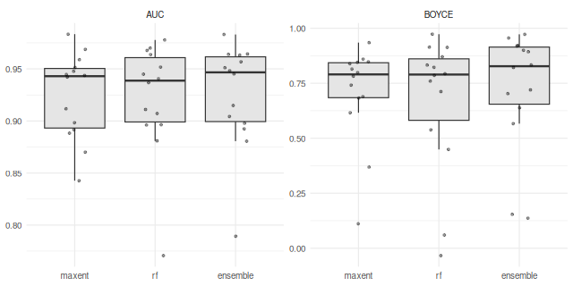
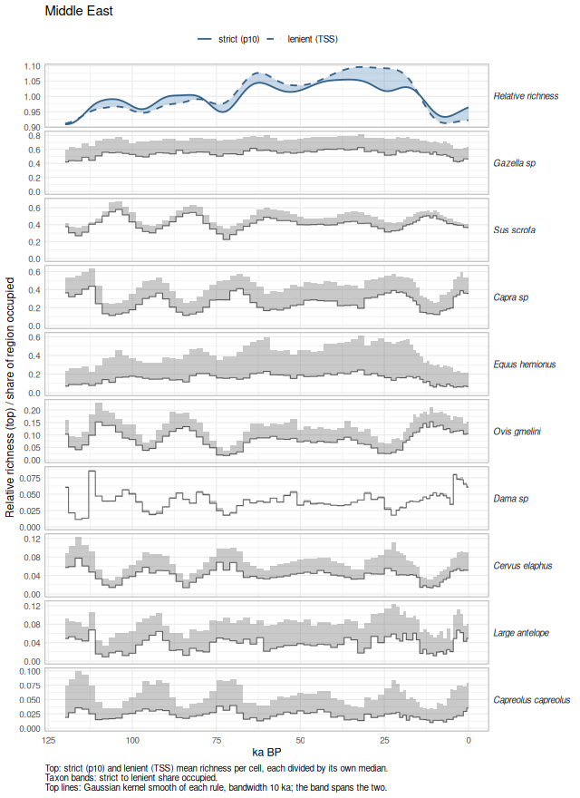
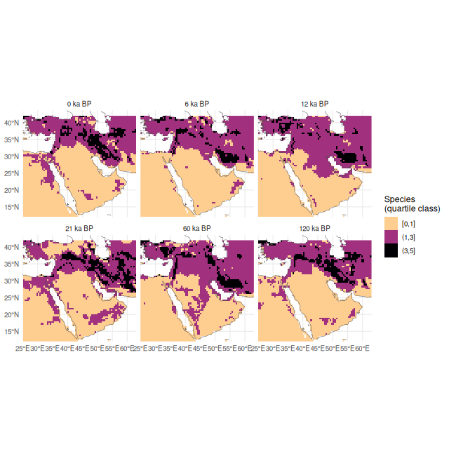
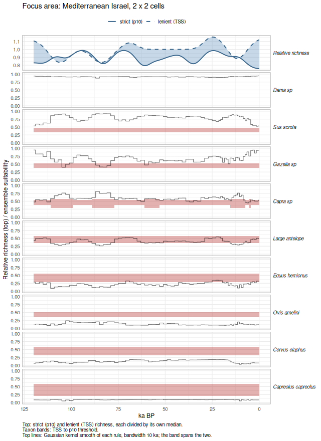

A complete analysis with the full pipeline: every bovid, cervid, equid and
wild boar on the Middle East's Pleistocene zooarchaeological list, modelled
against Beyer et al. (2020) palaeoclimate and hindcast across all 71 of its
slices back to 120 ka BP. Richness is read over the whole region and over a
focus area on the Mediterranean part of Israel.

**This vignette is precomputed.** It needs IUCN Red List range polygons,
which cannot be redistributed, and about 160 MB of prepared climate slices.
The code below is exactly what was run; `vignettes/precompute.R` re-renders
it from a local analysis folder. The model run is saved and keyed by the
species list, so editing the list and re-rendering fits only what changed.


``` r
library(richcast)
library(dplyr)
library(tidyr)
library(ggplot2)
packageVersion("richcast")
#> [1] '0.1.0'
```


``` r
# Paneled step plots: richness on top, one panel per taxon below. Bands are
# drawn as steps too; the top panel carries a Gaussian kernel smooth
# (bandwidth `bw` ka) over the middle of its band.
kernel_line <- function(d, bw = 10) {
  k <- stats::ksmooth(d$ka_bp, d$value, kernel = "normal", bandwidth = bw,
                      x.points = seq(min(d$ka_bp), max(d$ka_bp), by = 0.25))
  tibble(ka_bp = k$x, value = k$y)
}

# Expand points to step edges (half-way to each neighbour) so a ribbon
# follows the same steps as geom_step(direction = "mid"). The edges are
# nudged apart so no two rows share an x, which would otherwise let the
# ribbon cut diagonally across a step.
stepify <- function(d, eps = 1e-4) {
  d |>
    group_by(panel) |>
    arrange(ka_bp, .by_group = TRUE) |>
    mutate(left  = (ka_bp + lag(ka_bp, default = first(ka_bp))) / 2 + eps,
           right = (ka_bp + lead(ka_bp, default = last(ka_bp))) / 2 - eps) |>
    reframe(ka_bp = c(rbind(left, right)), lo = rep(lo, each = 2),
            hi = rep(hi, each = 2))
}

# Strict and lenient richness, each divided by its own median over the
# slices so the two cutoff rules share a scale.
relative_richness <- function(d) {
  d |>
    transmute(ka_bp, strict = strict / median(strict),
              lenient = lenient / median(lenient))
}

# The top panel: each rule's relative richness smoothed separately with a
# Gaussian kernel, the band spanning the two smoothed lines.
top_layers <- function(top, panel, bw) {
  sm <- tibble(
    ka_bp   = kernel_line(transmute(top, ka_bp, value = strict), bw)$ka_bp,
    strict  = kernel_line(transmute(top, ka_bp, value = strict), bw)$value,
    lenient = kernel_line(transmute(top, ka_bp, value = lenient), bw)$value,
    panel   = panel
  )
  lines <- sm |>
    pivot_longer(c(strict, lenient), names_to = "rule", values_to = "value") |>
    mutate(rule = factor(rule, c("strict", "lenient"),
                         c("strict (p10)", "lenient (TSS)")))
  list(
    geom_ribbon(data = sm, aes(ka_bp, ymin = pmin(strict, lenient),
                               ymax = pmax(strict, lenient)),
                inherit.aes = FALSE, fill = "steelblue", alpha = 0.3),
    geom_line(data = lines, aes(ka_bp, value, linetype = rule),
              inherit.aes = FALSE, colour = "steelblue4", linewidth = 0.8)
  )
}

panel_plot <- function(top, taxa, top_label, ylab, title, band_fill,
                       taxa_limits = c(0, 1), bw = 10, caption = NULL) {
  sp_order <- taxa |>
    group_by(panel) |>
    summarise(s = mean(value, na.rm = TRUE)) |>
    arrange(desc(s)) |>
    pull(panel)
  levs <- c(top_label, sp_order)
  taxa <- mutate(taxa, panel = factor(panel, levs))
  limits <- expand_grid(panel = factor(sp_order, levs), ka_bp = 0,
                        value = taxa_limits)
  bands <- stepify(filter(taxa, !is.na(lo), !is.na(hi)))

  ggplot(taxa, aes(ka_bp, value)) +
    geom_blank(data = limits) +
    top_layers(top, factor(top_label, levs), bw) +
    geom_ribbon(data = bands, aes(ka_bp, ymin = lo, ymax = hi),
                inherit.aes = FALSE, fill = band_fill, alpha = 0.35) +
    geom_step(direction = "mid", alpha = 0.55) +
    facet_wrap(~panel, ncol = 1, scales = "free_y", strip.position = "right",
               drop = FALSE) +
    scale_x_reverse() +
    scale_linetype_manual(values = c("solid", "dashed"), name = NULL) +
    labs(x = "ka BP", y = ylab, title = title,
         caption = paste0(caption, "\nTop lines: Gaussian kernel smooth of each rule, bandwidth ",
                          bw, " ka; the band spans the two.")) +
    theme_minimal() +
    theme(strip.text.y.right = element_text(angle = 0, hjust = 0,
                                            face = "italic"),
          panel.border = element_rect(fill = NA, colour = "grey75"),
          panel.spacing.y = unit(4, "pt"),
          plot.caption = element_text(hjust = 0),
          legend.position = "top")
}
```

## Species

Every species in an `UngulatePolygons` folder of IUCN downloads (bovids, cervids, equids,
wild boar),
keeping polygons coded extant and native or reintroduced, dissolved to one
range per species.


``` r
db <- build_taxon_db(iucn_folder("UngulatePolygons"),
                     quiet = TRUE)
# Only the names are shown: the polygons themselves are IUCN data, which may
# not be redistributed, even as printed coordinates.
nrow(db)
#> [1] 196
```

The region is the Middle East preset. The species modelled are those on the
bundled list of ungulates reported from Pleistocene zooarchaeological and
palaeontological sites in the region (Levant, Zagros, Syria, Arabia), with the
evidence and source for each. `?zooarch_taxa` gives the full references.


``` r
me <- region("middle_east")
me
zooarch_taxa(me) |> select(species, evidence, source)
#> # A tibble: 9 × 3
#>   species             evidence                                            source
#>   <chr>               <chr>                                               <chr> 
#> 1 Dama_sp             Fallow deer, the dominant prey at Qesem, Misliya, … Stine…
#> 2 Cervus_elaphus      Levant (Kebara, Hayonim, Qesem); Zagros (Ghar-e Bo… Stewa…
#> 3 Capreolus_capreolus Levant Middle Palaeolithic; Iran (Wezmeh, Kaldar)   Stewa…
#> 4 Gazella_sp          Gazelles: G. gazella dominant in the Levant (Misli… Yeshu…
#> 5 Large_antelope      Hartebeest at Hayonim, Geula B, El Wad and Skhul (… Grigg…
#> 6 Capra_sp            Wild goat dominates Levantine and Zagros caprines … Phill…
#> 7 Ovis_gmelini        Zagros (Kobeh, Shanidar; Ovis spp. at Wezmeh and Q… Stewa…
#> 8 Equus_hemionus      Levant; Arabia (Ti's al Ghadah, Empty Quarter, Shi… Stewa…
#> 9 Sus_scrofa          Levant Middle Palaeolithic (Qesem, Misliya, Hayoni… Stine…
```

Of those, only species whose present-day range lies within 10 degrees of the
region are trained:

### The species list

The list starts from the zooarchaeological defaults. **Edit it here**: add
species with `add` and drop them with `drop`, using IUCN binomials with an
underscore, e.g. `"Sus_scrofa"`. A changed list triggers a new model run
when the document is knitted; a list that has been run before reuses its
saved result.


``` r
add  <- c()   # e.g. c("Capra_ibex")
drop <- c()   # e.g. c("Capra_nubiana")

species <- setdiff(union(zooarch_taxa(me)$species, normalise_species(add)),
                   normalise_species(drop))
```

Species that are not reliably told apart in the zooarchaeological record
are one taxon each: fallow deer (`Dama_sp`), gazelles (`Gazella_sp`), wild
goat and ibex (`Capra_sp`), and hartebeest and oryx (`Large_antelope`). Each
member species is modelled on its own range, and the members are combined
afterwards: the taxon is present wherever any member is. (Modelling the
union of their ranges instead lets the largest range swamp the others.) The
groups come from the list's `members` column; edit `merges` to change them.


``` r
tx <- zooarch_taxa(me) |> filter(!is.na(members))
merges <- setNames(strsplit(tx$members, ";"), tx$species)
merges
#> $Dama_sp
#> [1] "Dama_dama"         "Dama_mesopotamica"
#> 
#> $Gazella_sp
#> [1] "Gazella_gazella"      "Gazella_subgutturosa" "Gazella_dorcas"      
#> 
#> $Large_antelope
#> [1] "Alcelaphus_buselaphus" "Oryx_leucoryx"        
#> 
#> $Capra_sp
#> [1] "Capra_aegagrus" "Capra_nubiana"
members <- lapply(setNames(species, species), \(t) merges[[t]] %||% t)
```

Species that are not in the range folder, or whose present range lies more
than 10 degrees from the region, cannot be trained:


``` r
all_members <- unique(unlist(members))
not_in_db <- setdiff(all_members, db$species)
too_far   <- setdiff(intersect(all_members, db$species),
                     species_near(db, me, quiet = TRUE))
not_in_db
#> character(0)
too_far
#> character(0)
usable <- setdiff(all_members, c(not_in_db, too_far))
included <- names(Filter(\(m) any(m %in% usable), members))
```

**Taxa included in the analysis** (9):


|taxon               |modelled_as                                             |evidence                                                                                                                                                                          |source                                                                                                   |
|:-------------------|:-------------------------------------------------------|:---------------------------------------------------------------------------------------------------------------------------------------------------------------------------------|:--------------------------------------------------------------------------------------------------------|
|Dama sp             |Dama dama + Dama mesopotamica                           |Fallow deer, the dominant prey at Qesem, Misliya, Kebara and Hayonim (Levant); reported as D. mesopotamica and D. dama                                                            |Stiner 2005; Yeshurun et al. 2007; Stiner et al. 2009; Davis 1974; Been et al. 2017; Stewart et al. 2019 |
|Cervus elaphus      |Cervus elaphus                                          |Levant (Kebara, Hayonim, Qesem); Zagros (Ghar-e Boof, Bisetun, Bawa Yawan); Iran                                                                                                  |Stewart et al. 2019; Mata-Gonzalez et al. 2023                                                           |
|Capreolus capreolus |Capreolus capreolus                                     |Levant Middle Palaeolithic; Iran (Wezmeh, Kaldar)                                                                                                                                 |Stewart et al. 2019; Mata-Gonzalez et al. 2023                                                           |
|Gazella sp          |Gazella gazella + Gazella subgutturosa + Gazella dorcas |Gazelles: G. gazella dominant in the Levant (Misliya, Kebara, Hayonim, Karaneh IV); G. subgutturosa at Umm el Tlel (Syria); G. dorcas in the terminal Pleistocene southern Levant |Yeshurun et al. 2007; Griggo 2004; Tsahar et al. 2009; Stewart et al. 2019                               |
|Large antelope      |Alcelaphus buselaphus + Oryx leucoryx                   |Hartebeest at Hayonim, Geula B, El Wad and Skhul (Levant); oryx at Umm el Tlel (Syria) and in the Empty Quarter                                                                   |Griggo 2004; McClure 1984; Stewart et al. 2019                                                           |
|Capra sp            |Capra aegagrus + Capra nubiana                          |Wild goat dominates Levantine and Zagros caprines (Kobeh, Shanidar, Ghar-e Boof, Kaldar, Wezmeh); ibex at Abu Noshra II and Nahal Aqev (reported as Capra ibex)                   |Phillips 1988; Rabinovich 2003; Stewart et al. 2019; Mata-Gonzalez et al. 2023                           |
|Ovis gmelini        |Ovis gmelini                                            |Zagros (Kobeh, Shanidar; Ovis spp. at Wezmeh and Qalehjough; reported as Ovis orientalis)                                                                                         |Stewart et al. 2019; Mata-Gonzalez et al. 2023                                                           |
|Equus hemionus      |Equus hemionus                                          |Levant; Arabia (Ti's al Ghadah, Empty Quarter, Shi'bat Dihya); Zagros (Wezmeh, Warwasi)                                                                                           |Stewart et al. 2019                                                                                      |
|Sus scrofa          |Sus scrofa                                              |Levant Middle Palaeolithic (Qesem, Misliya, Hayonim); Zagros (Ghar-e Boof); Jordan and Iran                                                                                       |Stiner 2005; Stiner et al. 2009; Stewart et al. 2019; Mata-Gonzalez et al. 2023                          |


## Climate

Beyer et al. (2020) at its native 0.5 degrees: the 0 BP slice for fitting,
and every published slice back to 120 ka BP for projection (1 ka steps to
22 ka, 2 ka steps beyond). Slices are prepared globally, so no species' study
extent is truncated. `prepare_climate()` skips slices already on disk.


``` r
steps_bp <- pastclim::get_time_bp_steps(dataset = "Beyer2020")
times_ce <- bp_to_ce(steps_bp[steps_bp < 0])
length(times_ce)
#> [1] 71

clim <- prepare_climate(
  "beyer",
  times        = times_ce,
  extent       = c(-180, 180, -60, 90),
  dataset_past = "Beyer2020",
  agg_past     = 1,
  present_dir  = "beyer_1950",
  quiet        = TRUE
)
clim
bioclim_vars
#> [1] "bio01" "bio04" "bio05" "bio06" "bio12" "bio15" "bio16" "bio17"
```

## The run

`run_hindcast_series()` uses the zooarchaeological list by default. Each
species: study extent of its range's bounding box plus 30% of the
diagonal, 100 pseudo-presences inside the polygon and 1000 background points,
a random forest + MaxEnt ensemble, the p10 threshold, and AUC and Boyce on a
25% hold-out. The run's result is saved and reused when this document is
re-knitted.


``` r
# One saved run per species list, so editing the list and knitting again
# never reuses a result fitted on different species.
run_file <- file.path("runs", paste0("res_", rlang::hash(list(sort(included), merges)), ".rds"))
if (file.exists(run_file)) {
  res <- readRDS(run_file)
} else {
  res <- run_hindcast_series(db, clim, times = times_ce, region = me,
                             species = included, merge = merges, quiet = TRUE)
  dir.create("runs", showWarnings = FALSE)
  saveRDS(res, run_file)
}
run_file
#> [1] "runs/res_3306b1f557eac13ab447839e559c5022.rds"
res
```

Species that were usable but could not be fitted:


``` r
setdiff(usable, names(res$fits))
#> character(0)
```

### Presence thresholds

Presence is read as a band rather than a line. The strict edge is each
model's p10 threshold, used throughout the run. The lenient edge is the
threshold that maximises the true skill statistic (TSS), treating cells
inside the species' present range polygon as presences and the rest of its
study extent as absences. For every species here it falls at or below p10, so
suitability between the two reads as possible but marginal presence. The
minimum-presence threshold (lowest suitability anywhere inside the range) is
listed too, but for wide-ranging species it falls close to zero, set by a
few ragged edge cells, so it is not used for the band.


``` r
thr <- presence_thresholds(res, db)
thr |> mutate(across(where(is.double), \(x) round(x, 3)))
#> # A tibble: 14 × 4
#>    species               threshold min_presence   tss
#>    <chr>                     <dbl>        <dbl> <dbl>
#>  1 Dama_dama                 0.557        0.427 0.427
#>  2 Dama_mesopotamica         0.56         0.34  0.559
#>  3 Cervus_elaphus            0.583        0.004 0.322
#>  4 Capreolus_capreolus       0.591        0.001 0.203
#>  5 Gazella_gazella           0.516        0.388 0.38 
#>  6 Gazella_subgutturosa      0.511        0.006 0.249
#>  7 Gazella_dorcas            0.498        0.036 0.399
#>  8 Alcelaphus_buselaphus     0.57         0.053 0.343
#>  9 Oryx_leucoryx             0.722        0.668 0.661
#> 10 Capra_aegagrus            0.578        0.05  0.282
#> 11 Capra_nubiana             0.547        0.134 0.379
#> 12 Ovis_gmelini              0.509        0.143 0.361
#> 13 Equus_hemionus            0.559        0.176 0.278
#> 14 Sus_scrofa                0.482        0.03  0.332

taxon_of <- unlist(lapply(names(res$taxa), \(t) setNames(rep(t, length(res$taxa[[t]])), res$taxa[[t]])))
thr <- thr |> mutate(taxon = taxon_of[species])
```

Cell-level suitability for every fitted species, for the region and the
focus area, is computed once per slice and saved next to the run.


``` r
focus <- region(c(34.5, 35.5, 31.5, 32.5), label = "focus area")
slice_keys <- c("present", as.character(times_ce))
to_ka <- function(t) ifelse(t == "present", 0, -ce_to_bp(suppressWarnings(as.numeric(t))) / 1000)

# Per cell and taxon: strict presence (any member above p10), lenient presence
# (any member above TSS), and the suitability and thresholds of the member
# furthest above its p10 threshold.
by_taxon <- function(g) {
  g |>
    filter(!is.na(suitability)) |>
    left_join(select(thr, species, taxon, tss), by = "species") |>
    group_by(x, y, taxon) |>
    summarise(strict  = any(suitability > threshold),
              lenient = any(suitability > tss),
              best    = which.max(suitability - threshold),
              suit    = suitability[best], p10 = threshold[best],
              tss     = tss[best], .groups = "drop") |>
    select(-best)
}

cells_file <- sub("\\.rds$", "_cells.rds", run_file)
if (file.exists(cells_file)) {
  cell_tbl <- readRDS(cells_file)
} else {
  cell_tbl <- lapply(slice_keys, function(k) {
    reg <- suitability_grid(res, me, k, clim)
    foc <- suitability_grid(res, focus, k, clim)
    list(region = by_taxon(reg), region_cells = attr(reg, "cells"),
         focus = by_taxon(foc))
  })
  names(cell_tbl) <- slice_keys
  saveRDS(cell_tbl, cells_file)
}
```

## Model performance

AUC and continuous Boyce index on the hold-out, for each member and for the
ensemble.


``` r
res$models |>
  select(starts_with("auc_"), starts_with("boyce_")) |>
  pivot_longer(everything(), names_to = c("metric", "model"),
               names_sep = "_") |>
  group_by(metric, model) |>
  summarise(median = median(value, na.rm = TRUE),
            q25 = quantile(value, 0.25, na.rm = TRUE),
            q75 = quantile(value, 0.75, na.rm = TRUE),
            min = min(value, na.rm = TRUE), .groups = "drop") |>
  mutate(across(where(is.numeric), \(x) round(x, 3)))
#> # A tibble: 6 × 6
#>   metric model    median   q25   q75    min
#>   <chr>  <chr>     <dbl> <dbl> <dbl>  <dbl>
#> 1 auc    ensemble  0.947 0.899 0.962  0.789
#> 2 auc    maxent    0.943 0.893 0.95   0.843
#> 3 auc    rf        0.939 0.899 0.961  0.771
#> 4 boyce  ensemble  0.827 0.655 0.914  0.137
#> 5 boyce  maxent    0.79  0.684 0.843  0.111
#> 6 boyce  rf        0.79  0.581 0.861 -0.034
```


``` r
res$models |>
  select(species, starts_with("auc_"), starts_with("boyce_")) |>
  pivot_longer(-species, names_to = c("metric", "model"), names_sep = "_") |>
  mutate(model = factor(model, c("maxent", "rf", "ensemble")),
         metric = toupper(metric)) |>
  ggplot(aes(model, value)) +
  geom_boxplot(outlier.shape = NA, fill = "grey90") +
  geom_jitter(width = 0.15, alpha = 0.4, size = 1) +
  facet_wrap(~metric, scales = "free_y") +
  labs(x = NULL, y = NULL) +
  theme_minimal()
```



Per species:


``` r
res$models |>
  mutate(across(where(is.double), \(x) round(x, 3))) |>
  arrange(desc(auc_ensemble))
#> # A tibble: 14 × 13
#>    species     taxon range_cells n_presence n_background threshold present_cells
#>    <chr>       <chr>       <int>      <int>        <int>     <dbl>         <int>
#>  1 Capreolus_… Capr…        3615        100         1000     0.591          2917
#>  2 Gazella_su… Gaze…        3291        100         1000     0.511          3207
#>  3 Oryx_leuco… Larg…          24         24         1000     0.722           165
#>  4 Equus_hemi… Equu…         382        100         1000     0.559          2061
#>  5 Gazella_do… Gaze…        3649        100         1000     0.498          3292
#>  6 Sus_scrofa  Sus_…       12704        100         1000     0.482         11498
#>  7 Cervus_ela… Cerv…        2475        100         1000     0.583          2673
#>  8 Ovis_gmeli… Ovis…         166        100         1000     0.509           371
#>  9 Capra_aega… Capr…         747        100         1000     0.578          1133
#> 10 Capra_nubi… Capr…         142        100         1000     0.547           446
#> 11 Dama_dama   Dama…         119        100         1000     0.557           225
#> 12 Gazella_ga… Gaze…          18         18          172     0.516            22
#> 13 Alcelaphus… Larg…        2673        100         1000     0.57           2967
#> 14 Dama_mesop… Dama…          11         11         1000     0.56            201
#> # ℹ 6 more variables: auc_maxent <dbl>, boyce_maxent <dbl>, auc_rf <dbl>,
#> #   boyce_rf <dbl>, auc_ensemble <dbl>, boyce_ensemble <dbl>
```

## Regional richness through time

Per slice, over the region's land cells: `strict` is the mean number of taxa
per cell above their p10 threshold, `lenient` the mean above their TSS
threshold, and `expected` the mean sum of suitabilities (no threshold).


``` r
rich <- bind_rows(lapply(slice_keys, function(k) {
  ct <- cell_tbl[[k]]
  per_cell <- ct$region |>
    group_by(x, y) |>
    summarise(strict = sum(strict), lenient = sum(lenient),
              expected = sum(suit), .groups = "drop")
  tibble(time = k, ka_bp = to_ka(k), cells = ct$region_cells,
         strict = mean(per_cell$strict), lenient = mean(per_cell$lenient),
         expected = mean(per_cell$expected))
}))
rich |>
  select(ka_bp, cells, strict, expected, lenient) |>
  mutate(across(c(strict, expected, lenient), \(x) round(x, 2)))
#> # A tibble: 72 × 5
#>    ka_bp cells strict expected lenient
#>    <dbl> <int>  <dbl>    <dbl>   <dbl>
#>  1     0  3489   1.55     2.04    2.25
#>  2   120  3521   1.52     2.04    2.26
#>  3   118  3551   1.36     1.94    2.2 
#>  4   116  3590   1.35     1.95    2.21
#>  5   114  3604   1.51     2.04    2.34
#>  6   112  3632   1.69     2.2     2.49
#>  7   110  3633   1.54     2.06    2.36
#>  8   108  3631   1.56     2.05    2.27
#>  9   106  3620   1.55     2.08    2.38
#> 10   104  3601   1.64     2.15    2.5 
#> # ℹ 62 more rows
```

Top panel: mean richness as a band between the strict (p10) and lenient (TSS)
counts. Each count is first divided by its own median across all slices, so
the two rules are put on one scale: 1 is that rule's typical richness, 1.1 is
10% above it. Each rule is then smoothed with a Gaussian kernel (solid:
strict, dashed: lenient), and the band spans the two smoothed lines. Below: the share of the region's land cells each taxon occupies,
the line at the strict threshold and the band reaching up to the lenient one.


``` r
occupancy <- bind_rows(lapply(slice_keys, function(k) {
  cell_tbl[[k]]$region |>
    group_by(taxon) |>
    summarise(value = sum(strict), hi = sum(lenient), .groups = "drop") |>
    mutate(ka_bp = to_ka(k), value = value / cell_tbl[[k]]$region_cells,
           hi = hi / cell_tbl[[k]]$region_cells, lo = value)
})) |>
  transmute(ka_bp, value, lo, hi, panel = gsub("_", " ", taxon))

panel_plot(
  top   = rich |> relative_richness(),
  taxa  = occupancy,
  top_label = "Relative richness",
  ylab  = "Relative richness (top) / share of region occupied",
  title = "Middle East",
  band_fill = "grey40",
  taxa_limits = c(0, NA),
  caption = "Top: strict (p10) and lenient (TSS) mean richness per cell, each divided by its own median.\nTaxon bands: strict to lenient share occupied."
)
```



### Maps

Colour classes are the quartiles of richness over every cell of every
slice, so a colour means the same thing in every panel. Richness is a small
integer, so quartile breaks that coincide are merged, which can leave fewer
than four classes.


``` r
all_cells <- richness_grid(res, times = c("present", as.character(res$times)))
breaks <- unique(quantile(all_cells$richness, probs = seq(0, 1, 0.25)))
breaks
#> [1] 0 1 3 5
classes <- cut(all_cells$richness, breaks, include.lowest = TRUE,
               dig.lab = 3)
class_levels <- levels(classes)

show_bp <- c(0, 6000, 12000, 21000, 60000, 120000)
keys <- ifelse(show_bp == 0, "present", as.character(bp_to_ce(-show_bp)))
grid <- richness_grid(res, times = keys) |>
  mutate(ka_bp = ifelse(time == "present", 0, -ce_to_bp(as.numeric(time)) / 1000),
         label = factor(paste(ka_bp, "ka BP"), paste(show_bp / 1000, "ka BP")),
         class = factor(cut(richness, breaks, include.lowest = TRUE, dig.lab = 3),
                        levels = class_levels))

coast <- sf::st_crop(sf::st_as_sf(rnaturalearth::ne_coastline(50, returnclass = "sf")),
                     xmin = me$box[1], xmax = me$box[2],
                     ymin = me$box[3], ymax = me$box[4])

ggplot(grid) +
  geom_raster(aes(x, y, fill = class)) +
  geom_sf(data = coast, linewidth = 0.2, colour = "grey30") +
  scale_fill_viridis_d(option = "magma", direction = -1, drop = FALSE,
                       end = 0.9) +
  facet_wrap(~label, ncol = 3) +
  coord_sf(expand = FALSE) +
  labs(x = NULL, y = NULL, fill = "Species\n(quartile class)") +
  theme_minimal()
```



## The focus area

A single 0.5-degree cell is too small a unit to read an assemblage from, so
the focus area is the 2 x 2 block of cells centred on the Mediterranean part
of Israel (35.0 E, 32.0 N): 34.5-35.5 E by 31.5-32.5 N, covering the coastal
plain from the Sharon to the southern coast, the Shephelah and the western
flanks of the Samarian and Judean hills. At today's sea level its
north-western cell is sea; in the glacial slices, with the coast further
west, all four cells are land.


``` r
focus
```

A taxon is present in the focus area when any member clears its threshold in
at least one of the cells. Its suitability is that of the member and cell
furthest above p10.


``` r
fa_species <- bind_rows(lapply(slice_keys, function(k) {
  cell_tbl[[k]]$focus |>
    group_by(taxon) |>
    summarise(strict = any(strict), lenient = any(lenient),
              i = which.max(suit - p10), suitability = suit[i],
              p10 = p10[i], tss = tss[i], .groups = "drop") |>
    select(-i) |>
    mutate(time = k, ka_bp = to_ka(k))
}))

fa_rich <- fa_species |>
  group_by(time, ka_bp) |>
  summarise(strict = sum(strict), lenient = sum(lenient),
            expected = sum(suitability),
            strict_taxa = paste(gsub("_", " ", taxon[strict]), collapse = ", "),
            marginal_taxa = paste(gsub("_", " ", taxon[lenient & !strict]), collapse = ", "),
            .groups = "drop") |>
  arrange(ka_bp)

fa_rich |>
  mutate(expected = round(expected, 2)) |>
  select(ka_bp, strict, lenient, expected, present = strict_taxa,
         marginal = marginal_taxa)
#> # A tibble: 72 × 6
#>    ka_bp strict lenient expected present        marginal
#>    <dbl>  <int>   <int>    <dbl> <chr>          <chr>   
#>  1     0      3       6     4.03 Cervus elaphus ""      
#>  2     1      3       6     3.98 Cervus elaphus ""      
#>  3     2      3       5     3.83 Cervus elaphus ""      
#>  4     3      3       6     4.01 Cervus elaphus ""      
#>  5     4      3       6     4    Cervus elaphus ""      
#>  6     5      3       5     3.71 Cervus elaphus ""      
#>  7     6      3       5     3.89 Cervus elaphus ""      
#>  8     7      3       5     3.77 Cervus elaphus ""      
#>  9     8      3       5     3.79 Cervus elaphus ""      
#> 10     9      4       4     3.78 Dama sp        ""      
#> # ℹ 62 more rows
```

Top panel: taxa present in the focus area, as a band between the strict and
lenient counts, each divided by its own median across slices and smoothed
with a Gaussian kernel (solid: strict, dashed: lenient).
Below, each taxon's ensemble suitability; the red band runs from its TSS
threshold (lenient) up to its p10 threshold (strict). Above the band the
taxon is present, inside it marginal, below it absent.


``` r
panel_plot(
  top   = fa_rich |> relative_richness(),
  taxa  = fa_species |> transmute(ka_bp, value = suitability, lo = tss, hi = p10,
                                  panel = gsub("_", " ", taxon)),
  top_label = "Relative richness",
  ylab  = "Relative richness (top) / ensemble suitability",
  title = "Focus area: Mediterranean Israel, 2 x 2 cells",
  band_fill = "firebrick",
  caption = "Top: strict (p10) and lenient (TSS) richness, each divided by its own median.\nTaxon bands: TSS to p10 threshold."
)
```



## Caveats

* The models assume niche conservatism, and the deep slices ask them to
  extrapolate furthest from the climate they were fitted on.
* Pseudo-presences come from IUCN polygons, so the models learn today's
  mapped range, including any part of it shaped by people rather than
  climate.
* The species list comes from sites spread across the region; a species on
  it need not have been recorded in the focus area itself.
* The focus area is about 95 by 110 km. Presence means suitable in at least
  one of its cells, so it reads as "within the area", not "throughout it".


``` r
sessionInfo()
#> R version 4.6.1 (2026-06-24)
#> Platform: x86_64-pc-linux-gnu
#> Running under: Ubuntu 24.04.5 LTS
#> 
#> Matrix products: default
#> BLAS:   /usr/lib/x86_64-linux-gnu/openblas-pthread/libblas.so.3 
#> LAPACK: /usr/lib/x86_64-linux-gnu/openblas-pthread/libopenblasp-r0.3.26.so;  LAPACK version 3.12.0
#> 
#> locale:
#>  [1] LC_CTYPE=en_US.UTF-8       LC_NUMERIC=C              
#>  [3] LC_TIME=en_US.UTF-8        LC_COLLATE=en_US.UTF-8    
#>  [5] LC_MONETARY=en_US.UTF-8    LC_MESSAGES=en_US.UTF-8   
#>  [7] LC_PAPER=en_US.UTF-8       LC_NAME=C                 
#>  [9] LC_ADDRESS=C               LC_TELEPHONE=C            
#> [11] LC_MEASUREMENT=en_US.UTF-8 LC_IDENTIFICATION=C       
#> 
#> time zone: Asia/Jerusalem
#> tzcode source: system (glibc)
#> 
#> attached base packages:
#> [1] stats     graphics  grDevices utils     datasets  methods   base     
#> 
#> other attached packages:
#> [1] ggplot2_4.0.3  tidyr_1.3.2    dplyr_1.2.1    richcast_0.1.0
#> 
#> loaded via a namespace (and not attached):
#>  [1] gtable_0.3.6                 compiler_4.6.1              
#>  [3] tidyselect_1.2.1             Rcpp_1.1.2                  
#>  [5] scales_1.4.0                 R6_2.6.1                    
#>  [7] labeling_0.4.3               generics_0.1.4              
#>  [9] classInt_0.4-11              s2_1.1.11                   
#> [11] sf_1.1-2                     knitr_1.51                  
#> [13] tibble_3.3.1                 units_1.0-1                 
#> [15] DBI_1.3.0                    pillar_1.11.1               
#> [17] RColorBrewer_1.1-3           rlang_1.2.0                 
#> [19] utf8_1.2.6                   terra_1.9-34                
#> [21] xfun_0.60                    S7_0.2.2                    
#> [23] rnaturalearth_1.2.0          otel_0.2.0                  
#> [25] viridisLite_0.4.3            cli_3.6.6                   
#> [27] withr_3.0.2                  magrittr_2.0.5              
#> [29] wk_0.9.5                     class_7.3-24                
#> [31] grid_4.6.1                   pastclim_2.2.0              
#> [33] lifecycle_1.0.5              vctrs_0.7.3                 
#> [35] KernSmooth_2.23-27           proxy_0.4-29                
#> [37] evaluate_1.0.5               glue_1.8.1                  
#> [39] farver_2.1.2                 codetools_0.2-20            
#> [41] rnaturalearthdata_1.0.0.9000 e1071_1.7-17                
#> [43] purrr_1.2.2                  tools_4.6.1                 
#> [45] pkgconfig_2.0.3
```
