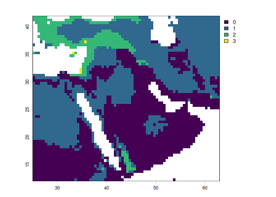

## Basic vignette for 'richcast'

'richcast' provides a hindcasted estimate of taxonomic richness for a given region and set of taxa, based on palaeoclimatic models and IUCN polygons fed to an SDM ensemble of maxent (background and pseudo-presences) and random forest (pseudo-absences and pseudo-presences) members, with suitability thresholded by p10 (default) or TSS. The projected, thresholded ranges are summed for each pixel, creating a richness surface. Fully worked out vignettes and applications are available in nxmarom/richcast/vignettes; this is a skeletal workflow meant for a quick start.

The IUCN polygons are stored in a subfolder ("geo_data") of the working directory ("try_richcast") under folders unzipped and renamed (for convenience) from the batch IUCN downloads. Here's how it looks on my machine:

```
nimrod@nX1:~/R_projects/try_richcast/geo_data$ ls
bovid_IUCN  cervid_IUCN  equid_IUCN  sus_IUCN                     <-- unzipped and renamed IUCN batch downloads
nimrod@nX1:~/R_projects/try_richcast/geo_data$ cd bovid_IUCN/     <-- so, e.g., for bovids
nimrod@nX1:~/R_projects/try_richcast/geo_data/bovid_IUCN$ ls      <-- that would be the content.
 data_0.cpg
 data_0.dbf
 data_0.prj
 data_0.shp
 data_0.shx
'IUCN Red List_Terms and Conditions of Use_v3.pdf'
'METADATA for Digital Distribution Maps of The IUCN Red List of Threatened Species.pdf'
 ReadMe.txt
```

After loading the library, we start with `build_taxon_db()`, which receives the IUCN range polygons, stored in a project subfolder, as just shown. It outputs an `sf` object with species and associated polygons, consolidated across each species range.


``` r
# load it, after installing with remotes::install_github("nxmarom/richcast")
library(richcast)

db <- build_taxon_db(
  iucn_folder("geo_data")
  )
#> ℹ Reading 4 range files from 'geo_data'
#> ✔ Reading 4 range files from 'geo_data' [604ms]
#> 
#> ℹ Dissolving 664 features into 196 species ranges.

db
#> <richcast_db>: 196 species, 0 trait columns
#> Simple feature collection with 196 features and 1 field
#> Geometry type: MULTIPOLYGON
#> Dimension:     XY
#> Bounding box:  xmin: -179.999 ymin: -53.80082 xmax: 179.999 ymax: 83.6341
#> Geodetic CRS:  WGS 84
#> # A tibble: 196 × 2
#>    species                                                              geometry
#>    <chr>                                                      <MULTIPOLYGON [°]>
#>  1 Addax_nasomaculatus    (((-6.713317 22.50058, -6.732364 22.49953, -6.751352 …
#>  2 Aepyceros_melampus     (((14.7884 -14.91663, 14.77369 -14.91405, 14.75659 -1…
#>  3 Alcelaphus_buselaphus  (((30.3391 6.862536, 30.1958 6.933636, 30.1724 6.9547…
#>  4 Alces_alces            (((132.4032 43.18214, 132.398 43.18574, 132.3935 43.1…
#>  5 Ammodorcas_clarkei     (((45.5029 5.663136, 45.5077 5.665036, 45.5918 5.7446…
#>  6 Ammotragus_lervia      (((12.1053 31.8098, 12.1053 31.84402, 12.07108 31.919…
#>  7 Antidorcas_marsupialis (((13.4583 -12.52166, 13.4556 -12.52406, 13.4217 -12.…
#>  8 Antilope_cervicapra    (((76.3677 28.74614, 76.2647 28.70064, 75.8395 28.512…
#>  9 Arabitragus_jayakari   (((55.80734 24.01054, 55.79523 24.05346, 55.7897 24.0…
#> 10 Axis_axis              (((82.06373 28.43588, 81.11355 28.92857, 80.19858 29.…
#> # ℹ 186 more rows
```

You may be interested in a few key species. These are the guys that figure prominently in the prehistory of the Levant; let's use only those, for brevity.


``` r
sel_species <- c("Dama_dama", "Dama_mesopotamica", "Sus_scrofa", "Gazella_gazella", "Gazella_dorcas", "Cervus_elaphus")

db_sbs <- db[db$species %in% sel_species, ]

db_sbs
#> Simple feature collection with 6 features and 1 field
#> Geometry type: MULTIPOLYGON
#> Dimension:     XY
#> Bounding box:  xmin: -17.10318 ymin: -8.8495 xmax: 141.5463 ymax: 66.96124
#> Geodetic CRS:  WGS 84
#> <richcast_db>: 6 species, 0 trait columns
#> # A tibble: 6 × 2
#>   species                                                               geometry
#>   <chr>                                                       <MULTIPOLYGON [°]>
#> 1 Cervus_elaphus    (((9.2831 41.57134, 9.2895 41.59674, 9.288858 41.597, 9.283…
#> 2 Dama_dama         (((28.0304 43.24864, 28.0358 43.25234, 28.0384 43.25894, 28…
#> 3 Dama_mesopotamica (((48.2753 32.01584, 48.2859 32.03364, 48.2824 32.05494, 48…
#> 4 Gazella_dorcas    (((32.5593 29.96684, 32.56358 29.9645, 32.56318 29.96511, 3…
#> 5 Gazella_gazella   (((35.7265 33.32874, 35.7234 33.33634, 35.5861 33.27224, 35…
#> 6 Sus_scrofa        (((80.21465 9.831354, 80.20515 9.829801, 80.17722 9.82157, …
```

We'll do the hindcast using the "Beyer2020" dataset from pastclim. I always get confused with the time steps, so


``` r
steps_bp <- pastclim::get_time_bp_steps(dataset = "Beyer2020")
steps_bp[50:60]                               # years BP, as negative numbers: just to see how it looks
#>  [1] -22000 -21000 -20000 -19000 -18000 -17000 -16000 -15000 -14000 -13000
#> [11] -12000

times_ce <- bp_to_ce(steps_bp[steps_bp < 0])  # richcast works in years CE; the present is added separately
better_times <- times_ce[57:61]               # it's close to lunch already
better_times
#> [1] -13050 -12050 -11050 -10050  -9050
```

Ok, now prepare the climate part of the model...


``` r
clim <- prepare_climate(
  "beyer",                              # that's a new sub-directory where the rasters go
  vars         = bioclim_vars,          # eight by default, you can change that
  times        = better_times,          # indeed
  extent       = c(-180, 180, -60, 90), # all over, or get your own (xmin, xmax, ymin, ymax)
  dataset_past = "Beyer2020",           # use "Beyer2020"
  agg_past     = 1,                     # to overcome resolution mismatch if training on a different product
  present_dir  = "beyer_1950",          # that's our present, so it's the same resolution
  quiet        = TRUE                   # unless you are bored
)

clim
#> <richcast_climate> <climate_dir>
#> 71 slices: -118050 to 950 CE
```

Now the model. Species that belong to a merged taxon are folded into it, so `species` can simply list the species.


``` r
res <- run_hindcast_series(
  db_sbs, clim,                             # see above
  times        = better_times,              # oh will they ever come
  region       = region("middle_east"),     # there are some presets, see help
  species      = sel_species,               # just the ones we need
  merge        = list(                      # manually merge species, useful for zooarch
    Cervid     = c("Dama_dama",
                   "Dama_mesopotamica",
                   "Cervus_elaphus"),
    Gazella_sp = c("Gazella_gazella",
                   "Gazella_dorcas")
    ),
  predictors = c("bio01", "bio12"),         # lunch
  quiet      = TRUE                         # please
)

res$taxa # which species went into which taxon
#> $Cervid
#> [1] "Dama_dama"         "Dama_mesopotamica" "Cervus_elaphus"   
#> 
#> $Sus_scrofa
#> [1] "Sus_scrofa"
#> 
#> $Gazella_sp
#> [1] "Gazella_gazella" "Gazella_dorcas"
```

The resulting object contains many things that you can use, hopefully.


``` r
res$models   # a summary of the models with some results and fit metrics
#> # A tibble: 6 × 14
#>   species      taxon range_cells n_presence n_background threshold present_cells
#>   <chr>        <chr>       <int>      <int>        <int>     <dbl>         <int>
#> 1 Dama_dama    Cerv…         119        100         1000     0.537           537
#> 2 Dama_mesopo… Cerv…          11         11         1000     0.674           267
#> 3 Cervus_elap… Cerv…        2475        100         1000     0.538          3169
#> 4 Sus_scrofa   Sus_…       12704        100         1000     0.439         18538
#> 5 Gazella_gaz… Gaze…          18         18          172     0.504            31
#> 6 Gazella_dor… Gaze…        3649        100         1000     0.653          3144
#> # ℹ 7 more variables: n_maxnet_background <int>, auc_maxent <dbl>,
#> #   boyce_maxent <dbl>, auc_rf <dbl>, boyce_rf <dbl>, auc_ensemble <dbl>,
#> #   boyce_ensemble <dbl>
names(res$surfaces) # the richness surfaces, one per slice, that you can plot
#> [1] "present" "-13050"  "-12050"  "-11050"  "-10050"  "-9050"
temp <- richness_surface(res, -10050) # unwraps it: surfaces are stored wrapped, so the result can be saved as an RDS
terra::plot(temp) # plot from 'terra'
```



``` r
richness_at(res, 35.0500, 32.7333, -12050, climate = clim) # or the richness in Mt. Carmel, so long ago.
#> <richcast_point>
#> (35.05, 32.7333) @ -12050: richness 2
#> Cervid and Sus_scrofa
#> `$richness` `$species`
```
