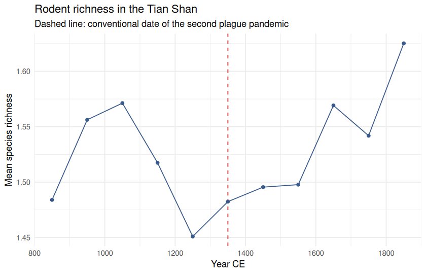
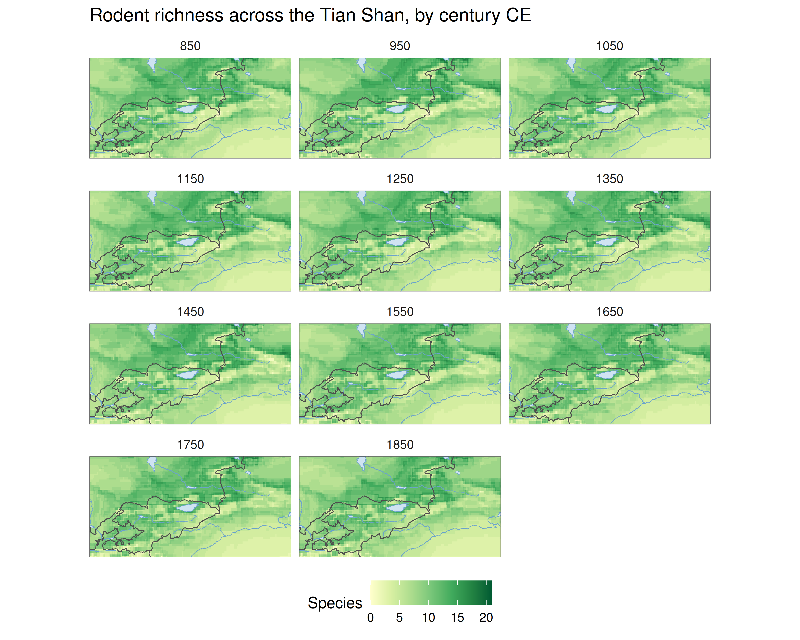
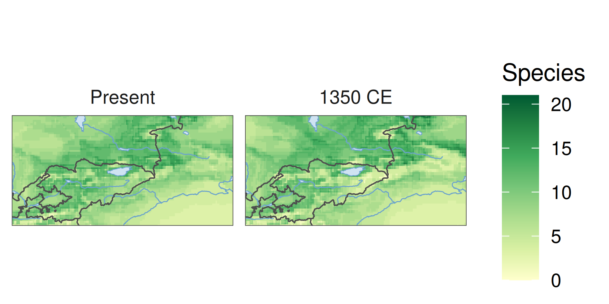
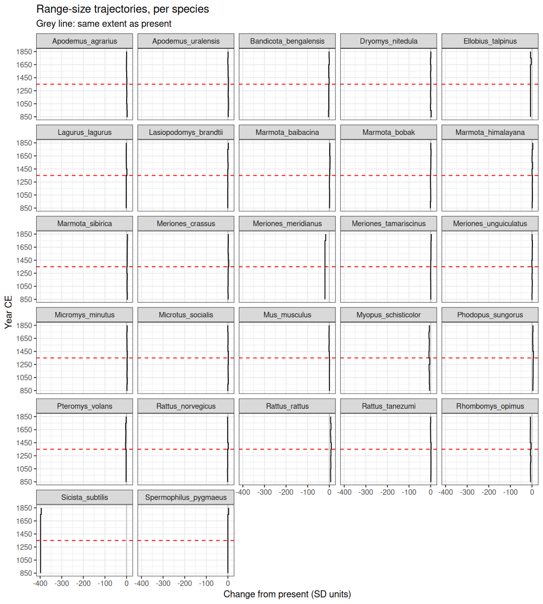
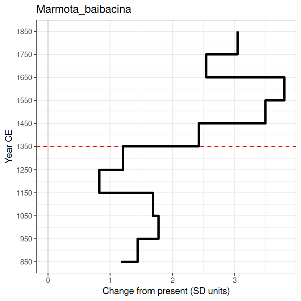
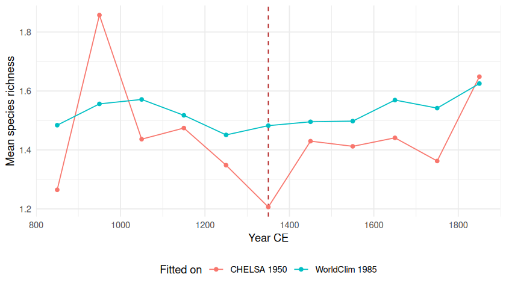

A complete analysis: eleven centuries of rodent distributions across the
Tian Shan, from a global IUCN range download and CHELSA-TraCE21k
palaeoclimate.

The question behind it is epidemiological. The Tian Shan is a plague focus,
and the second pandemic is conventionally dated to the mid-fourteenth century.
If climate reorganised the local rodent assemblage in the run-up to 1350 --
particularly the marmots and gerbils that act as reservoirs -- that
reorganisation is a candidate part of the story. This vignette produces the
distributional evidence; it does not attempt the epidemiology.

**This vignette is precomputed.** It runs against a global Red List download
and roughly 170 MB of prepared climate slices, neither of which can be
redistributed or fetched at build time. The code below is exactly what was
run; see `vignettes/precompute.R`.


``` r
library(richcast)
library(dplyr)
#> 
#> Attaching package: 'dplyr'
#> The following objects are masked from 'package:stats':
#> 
#>     filter, lag
#> The following objects are masked from 'package:base':
#> 
#>     intersect, setdiff, setequal, union
library(ggplot2)
```

## Study design


``` r
VARS <- c("bio01", "bio04", "bio05", "bio06",
          "bio12", "bio15", "bio16", "bio17")
TIMES <- seq(850, 1850, by = 100)

tianshan <- focus_box(c(68, 87, 39, 46), label = "Tian Shan")
karadja  <- focus_box(c(74.38, 74.99, 42.58, 43.03), label = "Karadja")
```

Eight bioclimatic variables: annual mean temperature and its seasonality, the
warmest and coldest month extremes, annual precipitation and its seasonality,
and the wettest and driest quarters. Eleven centennial slices. The wider focus
is the Tian Shan; `karadja` is a 50 km box around the Chüy Valley cemeteries,
carried through as a subregion so site-scale richness is reported alongside
the regional figure.

## Climate

Slices were prepared once, up front. WorldClim 2.1 at 5 arc-minutes provides
the present-day fitting climate (aggregated by 2); CHELSA-TraCE21k at 0.5
arc-minutes provides the past (aggregated by 20). Both land on 10 arc-minutes,
which is the point -- a model fitted on one grid and projected onto another
produces a plausible-looking surface that means nothing.


``` r
clim <- prepare_climate(
  path   = "Inputs/Climate/eurasia_slices",
  vars   = VARS,
  times  = TIMES,
  extent = c(-15, 180, 10, 82)      # Eurasia
)
```


``` r
clim <- climate_dir("../../Inputs/Climate/eurasia_slices")
clim
#> <richcast_climate> <climate_dir>
#> 11 slices: 850 to 1850 CE

check_climate_grids(clim, VARS)
#> ✔ 12 slices share one grid (0.1667 x 0.1667 deg).
```

## Taxa

Ranges come from a global Rodentia download from the IUCN Red List spatial
portal. These are **not** redistributed with `richcast` -- the Red List Terms
of Use prohibit it -- so this step needs your own download.

Traits come from `rodent_traits`, bundled from Ecke et al. (2022), which
scores rodent species for synanthropy and zoonotic reservoir status.


``` r
db <- build_taxon_db(
  ranges = iucn_shapefile("../../Inputs/geo_data/iucn_rodentia/data_0.shp"),
  traits = rodent_traits
)
#> ℹ Reading 'data_0.shp'
#> ✔ Reading 'data_0.shp' [1.1s]
#> 
#> ℹ Dissolving 3090 features into 2345 species ranges.
#> ! Spherical union failed on invalid geometry; retrying in planar mode.
#> although coordinates are longitude/latitude, st_union assumes that they are
#> planar
#> ℹ Trait join: 400/2345 species matched, 1945 with NA traits.
#> ! Filtering on a trait column will silently drop the 1945 unmatched species.
```

Note the dissolve. A global Rodentia download stores 3090 features for 2345
species, splitting widespread taxa by subspecies and disjunct patch. Modelling
features rather than species would train each model against a fragment of its
own range while feeding the remainder to the background sample.

`S_index` is the synanthropy score. Every species present in the Ecke table
scores above zero, so filtering on it is really a presence-in-table filter --
worth being explicit about, since it looks like a threshold:


``` r
db <- filter_taxa(db, !is.na(S_index))
#> ℹ Filter kept 248/2345 species (2097 removed).
```

## Running the series

One call. Each species is fitted once against present-day climate and then
projected onto all eleven slices; species whose ranges fall outside the
buffered focus never get fitted at all.


``` r
res <- run_hindcast_series(
  db, clim,
  times      = TIMES,
  focus      = tianshan,
  subregions = list(karadja = karadja),
  predictors = VARS,
  resolution = 0.1,
  on_error   = "warn",
  quiet      = TRUE
)
res
#> <richcast_series>
#> 32 species x 11 slices (850-1850 CE)
#> focus: Tian Shan
#> `$richness` `$species` `$models` `$fits` `$ranges`
```

### Model diagnostics


``` r
res$models |>
  arrange(desc(auc)) |>
  print(n = Inf)
#> # A tibble: 32 × 6
#>    species                   auc threshold n_presence n_background present_cells
#>    <chr>                   <dbl>     <dbl>      <int>        <int>         <int>
#>  1 Arvicola_amphibius      0.990     0.94         100          100             0
#>  2 Micromys_minutus        0.990     0.9          100          100          1528
#>  3 Lasiopodomys_brandtii   0.983     0.848         93          100           116
#>  4 Spermophilus_pygmaeus   0.983     0.89         100          100             0
#>  5 Ellobius_talpinus       0.983     0.88         100          100            17
#>  6 Allocricetulus_eversma… 0.981     0.88         100          100             0
#>  7 Sicista_subtilis        0.981     0.84         100          100           120
#>  8 Microtus_agrestis       0.981     0.86         100          100            62
#>  9 Bandicota_bengalensis   0.975     0.930         99          100            20
#> 10 Phodopus_sungorus       0.974     0.88         100          100            51
#> 11 Rattus_tanezumi         0.973     0.858         71          100           765
#> 12 Rattus_norvegicus       0.973     0.85         100          100           117
#> 13 Lagurus_lagurus         0.972     0.879         82          100            63
#> 14 Meriones_crassus        0.967     0.85         100          100           175
#> 15 Marmota_bobak           0.965     0.796         70          100           488
#> 16 Castor_fiber            0.962     0.862         69          100             0
#> 17 Apodemus_agrarius       0.961     0.77         100          100          2818
#> 18 Meriones_tamariscinus   0.958     0.776         90          100          4585
#> 19 Microtus_socialis       0.958     0.816         59          100          1194
#> 20 Myopus_schisticolor     0.955     0.82         100          100           858
#> 21 Cricetulus_barabensis   0.954     0.84         100          100            71
#> 22 Pteromys_volans         0.953     0.77         100          100         11364
#> 23 Meriones_meridianus     0.953     0.85         100          100             6
#> 24 Marmota_himalayana      0.951     0.79         100          100           797
#> 25 Rhombomys_opimus        0.949     0.78         100          100          1728
#> 26 Apodemus_uralensis      0.949     0.77         100          100          3819
#> 27 Meriones_unguiculatus   0.949     0.79         100          100          2148
#> 28 Marmota_sibirica        0.936     0.8          100          100          1446
#> 29 Mus_musculus            0.935     0.74         100          100         53483
#> 30 Dryomys_nitedula        0.931     0.730         92          100         14028
#> 31 Marmota_baibacina       0.914     0.71         100          100          2192
#> 32 Rattus_rattus           0.909     0.73         100          100         22583
```

AUC here is computed on the training data, so it measures fit rather than
transferability, and should be read as a screen for models that failed rather
than as evidence a model is good. Thresholds are TSS-optimised per species.

Two columns deserve a look before trusting any of the rest. `n_presence` is
the number of presence samples actually drawn: `fit_sdm()` asks for 100, but a
species whose range covers fewer than 100 cells at this resolution cannot
supply them, and those models rest on a thinner base than the AUC suggests.
`present_cells` is the modelled present-day range in cells — where it is zero,
the species contributes nothing to richness at any slice and its deltas are
all zero by construction.


``` r
res$models |>
  filter(n_presence < 100 | present_cells == 0) |>
  arrange(present_cells, n_presence)
#> # A tibble: 12 × 6
#>    species                   auc threshold n_presence n_background present_cells
#>    <chr>                   <dbl>     <dbl>      <int>        <int>         <int>
#>  1 Castor_fiber            0.962     0.862         69          100             0
#>  2 Allocricetulus_eversma… 0.981     0.88         100          100             0
#>  3 Arvicola_amphibius      0.990     0.94         100          100             0
#>  4 Spermophilus_pygmaeus   0.983     0.89         100          100             0
#>  5 Bandicota_bengalensis   0.975     0.930         99          100            20
#>  6 Lagurus_lagurus         0.972     0.879         82          100            63
#>  7 Lasiopodomys_brandtii   0.983     0.848         93          100           116
#>  8 Marmota_bobak           0.965     0.796         70          100           488
#>  9 Rattus_tanezumi         0.973     0.858         71          100           765
#> 10 Microtus_socialis       0.958     0.816         59          100          1194
#> 11 Meriones_tamariscinus   0.958     0.776         90          100          4585
#> 12 Dryomys_nitedula        0.931     0.730         92          100         14028
```

The four species with no present-day range are worth dwelling on, because
they carry some of the *highest* AUCs in the table. That combination is
diagnostic rather than contradictory: a model can separate its training
presences from its background almost perfectly and still place its
TSS-optimised threshold above anything the study region actually offers. For
these taxa the Tian Shan sits at the edge of a range centred elsewhere, so the
honest reading is "no suitable habitat here", not "good model". They are left
in so the count is visible; filter them out before interpreting richness if
you would rather they not dilute the mean.

## Richness over time


``` r
res$richness |>
  select(period, time, mean_richness, max_richness, karadja_max) |>
  print(n = Inf)
#> # A tibble: 12 × 5
#>    period         time mean_richness max_richness karadja_max
#>    <chr>         <dbl>         <dbl>        <dbl>       <dbl>
#>  1 present          NA          1.47            5           3
#>  2 hindcast_850    850          1.48            5           4
#>  3 hindcast_950    950          1.56            5           4
#>  4 hindcast_1050  1050          1.57            5           4
#>  5 hindcast_1150  1150          1.52            5           4
#>  6 hindcast_1250  1250          1.45            4           4
#>  7 hindcast_1350  1350          1.48            5           4
#>  8 hindcast_1450  1450          1.50            5           4
#>  9 hindcast_1550  1550          1.50            5           4
#> 10 hindcast_1650  1650          1.57            5           4
#> 11 hindcast_1750  1750          1.54            5           4
#> 12 hindcast_1850  1850          1.63            5           4
```


``` r
res$richness |>
  filter(period != "present") |>
  ggplot(aes(time, mean_richness)) +
  geom_vline(xintercept = 1350, colour = "firebrick", linetype = "dashed") +
  geom_line(colour = "#3a5a8c") +
  geom_point(colour = "#3a5a8c") +
  labs(
    x = "Year CE", y = "Mean species richness",
    title = "Rodent richness in the Tian Shan",
    subtitle = "Dashed line: conventional date of the second plague pandemic"
  ) +
  theme_minimal()
```



### Where the richness is

A regional mean says how many species, not where. `run_hindcast_series()`
keeps the richness surface for every slice, and `richness_grid()` returns them
in long form for mapping.

Reference geography makes those maps readable: in this region Issyk-Kul,
Balkhash and the Ili and Syr Darya do more to orient a reader than the
graticule does. Countries and coastlines ship with \pkg{rnaturalearth}; lakes
and rivers are downloaded once and cached, and are simply omitted if the
download is unavailable.


``` r
cache <- tools::R_user_dir("richcast", "cache")
dir.create(cache, recursive = TRUE, showWarnings = FALSE)

ne_physical <- function(type) {
  tryCatch(
    rnaturalearth::ne_download(scale = 10, type = type, category = "physical",
                               returnclass = "sf", destdir = cache),
    error = function(e) NULL
  )
}

bb <- sf::st_bbox(tianshan$geometry)

# Natural Earth polygons are valid in the plane but not on the sphere, so sf's
# s2 backend refuses to crop them ("Loop 0 is not valid"). This is the same
# problem richcast handles internally for range polygons. Disable s2 for the
# clip, then put it back.
old_s2 <- sf::sf_use_s2()
suppressMessages(sf::sf_use_s2(FALSE))

clip <- function(x) {
  if (is.null(x)) return(NULL)
  tryCatch(suppressWarnings(sf::st_crop(x, bb)), error = function(e) NULL)
}

borders <- clip(rnaturalearth::ne_countries(scale = "large", returnclass = "sf"))
#> although coordinates are longitude/latitude, st_intersection assumes that they
#> are planar
lakes   <- clip(ne_physical("lakes"))
#> Loading 'ne_10m_lakes.gpkg' from cache...
#> although coordinates are longitude/latitude, st_intersection assumes that they
#> are planar
rivers  <- clip(ne_physical("rivers_lake_centerlines"))
#> Loading 'ne_10m_rivers_lake_centerlines.gpkg' from cache...
#> although coordinates are longitude/latitude, st_intersection assumes that they
#> are planar

suppressMessages(sf::sf_use_s2(old_s2))

vapply(list(borders = borders, lakes = lakes, rivers = rivers),
       function(x) if (is.null(x)) 0L else nrow(x), integer(1))
#> borders   lakes  rivers 
#>       5      10      13
```


``` r
# One specification, reused by every map below.
geo_layers <- function() {
  list(
    if (!is.null(rivers))
      geom_sf(data = rivers, colour = "#6ba3cc", linewidth = 0.22, inherit.aes = FALSE),
    if (!is.null(lakes))
      geom_sf(data = lakes, fill = "#cfe3f2", colour = "#6ba3cc",
              linewidth = 0.18, inherit.aes = FALSE),
    if (!is.null(borders))
      geom_sf(data = borders, fill = NA, colour = "grey30",
              linewidth = 0.28, inherit.aes = FALSE),
    coord_sf(xlim = c(bb[["xmin"]], bb[["xmax"]]),
             ylim = c(bb[["ymin"]], bb[["ymax"]]),
             expand = FALSE, datum = NA),
    scale_fill_distiller(palette = "YlGn", direction = 1, name = "Species"),
    labs(x = NULL, y = NULL),
    theme_minimal(),
    theme(panel.grid = element_blank(),
          panel.background = element_rect(fill = "white", colour = NA),
          axis.text = element_text(size = 7))
  )
}
```


``` r
grid <- richness_grid(res)

ggplot() +
  geom_raster(data = grid, aes(x, y, fill = richness)) +
  geo_layers() +
  facet_wrap(~time, ncol = 3) +
  ggtitle("Rodent richness across the Tian Shan, by century CE") +
  theme(legend.position = "bottom")
```



A single slice against the present-day baseline, on a shared scale:


``` r
pair <- richness_grid(res, times = c("present", "1350")) |>
  mutate(time = factor(time, levels = c("present", "1350"),
                       labels = c("Present", "1350 CE")))

ggplot() +
  geom_raster(data = pair, aes(x, y, fill = richness)) +
  geo_layers() +
  facet_wrap(~time)
```



Individual surfaces come back as `SpatRaster`s, for writing out or for further
`terra` work:


``` r
richness_surface(res, 1350)
#> class       : SpatRaster
#> size        : 70, 190, 1  (nrow, ncol, nlyr)
#> resolution  : 0.1, 0.1  (x, y)
#> extent      : 68, 87, 39, 46  (xmin, xmax, ymin, ymax)
#> coord. ref. : lon/lat WGS 84 (EPSG:4326)
#> source(s)   : memory
#> name        : richness
#> min value   :        0
#> max value   :        5
```

## Species trajectories

`res$species` carries one row per species per slice, with each range expressed
as a suitable-cell count and differenced two ways.

One species across all eleven slices:


``` r
res$species |>
  filter(species == "Marmota_baibacina") |>
  select(time, cells, delta_from_previous, delta_from_present)
#> # A tibble: 11 × 4
#>     time cells delta_from_previous delta_from_present
#>    <dbl> <int>               <int>              <int>
#>  1   850  2751                  NA                559
#>  2   950  2878                 127                686
#>  3  1050  3034                 156                842
#>  4  1150  2991                 -43                799
#>  5  1250  2585                -406                393
#>  6  1350  2766                 181                574
#>  7  1450  3342                 576               1150
#>  8  1550  3852                 510               1660
#>  9  1650  3997                 145               1805
#> 10  1750  3399                -598               1207
#> 11  1850  3639                 240               1447
```

Both deltas are computed after sorting time numerically. Note the single `NA`
at 850 CE -- the earliest slice has no predecessor, so exactly one row per
species should be missing `delta_from_previous`. Sorting years as text puts
850 and 950 *after* 1850, which moves that `NA` to the wrong row and mis-lags
every difference: the kind of error that survives review because the resulting
table still looks perfectly orderly.


``` r
# One missing lag per species, and it is always the earliest slice.
res$species |>
  summarise(
    species          = dplyr::n_distinct(species),
    missing_lags     = sum(is.na(delta_from_previous)),
    all_at_earliest  = all(time[is.na(delta_from_previous)] == min(time))
  )
#> # A tibble: 1 × 3
#>   species missing_lags all_at_earliest
#>     <int>        <int> <lgl>          
#> 1      32           32 TRUE
```

To compare species with very different range sizes, put each trajectory in
units of its own standard deviation. Note that this divides by the SD without
subtracting the mean: `scale()` would do both, which moves zero to *average
change across the series* while it still looks like *no change from present* --
and if most slices were smaller than today, every taxon then appears to sit a
full standard deviation above the line for purely arithmetic reasons.


``` r
traj <- res$species |>
  group_by(species) |>
  filter(stats::sd(delta_from_present, na.rm = TRUE) > 0) |>
  mutate(z = delta_from_present / stats::sd(delta_from_present, na.rm = TRUE)) |>
  ungroup()
```

Time runs down the vertical axis, as in a stratigraphic column, so a century
reads as a level rather than a position along a line. Each panel is one
species; the grey vertical rule is no change from present, the red horizontal
rule is 1350 CE. Steps rather than lines, because a centennial slice is an
interval, not an instant.


``` r
ggplot(traj, aes(y = time, x = z, group = species)) +
  geom_vline(xintercept = 0, colour = "gray") +
  geom_hline(yintercept = 1350, colour = "red", linetype = "dashed") +
  geom_step(orientation = "y") +
  scale_y_continuous(breaks = seq(850, 1850, by = 200)) +
  facet_wrap(~species, ncol = 5) +
  labs(x = "Change from present (SD units)", y = "Year CE",
       title = "Range-size trajectories, per species",
       subtitle = "Grey line: same extent as present") +
  theme_bw()
```



A single species at readable size, with every slice labelled:


``` r
traj |>
  filter(species == "Marmota_baibacina") |>
  ggplot(aes(y = time, x = z)) +
  geom_vline(xintercept = 0, colour = "gray") +
  geom_hline(yintercept = 1350, colour = "red", linetype = "dashed") +
  geom_step(orientation = "y", linewidth = 1.3) +
  scale_y_continuous(breaks = seq(850, 1850, by = 100)) +
  labs(x = "Change from present (SD units)", y = "Year CE") +
  ggtitle("Marmota_baibacina") +
  theme_bw()
```



## Does the fitting dataset matter?

The run above fits on WorldClim and projects onto CHELSA-TraCE21k. That means
the model crosses products between fitting and projection, so any systematic
difference between WorldClim and CHELSA is folded into what looks like climate
change. CHELSA-TraCE21k publishes its own present-day slice, so the alternative
is to stay within one product throughout -- `present` is just a directory name:


``` r
clim_chelsa <- climate_dir("../../Baibacina/climate", present = "chelsa_1950")

res_chelsa <- run_hindcast_series(
  db, clim_chelsa,
  times = TIMES, focus = tianshan,
  subregions = list(karadja = karadja),
  predictors = VARS, resolution = 0.1,
  on_error = "warn", quiet = TRUE
)
```


``` r
comparison <- inner_join(
  res$richness        |> filter(period != "present") |> select(time, worldclim_fit = mean_richness),
  res_chelsa$richness |> filter(period != "present") |> select(time, chelsa_fit    = mean_richness),
  by = "time"
)
comparison |> mutate(difference = chelsa_fit - worldclim_fit)
#> # A tibble: 11 × 4
#>     time worldclim_fit chelsa_fit difference
#>    <dbl>         <dbl>      <dbl>      <dbl>
#>  1   850          1.48       1.26    -0.219 
#>  2   950          1.56       1.86     0.301 
#>  3  1050          1.57       1.44    -0.135 
#>  4  1150          1.52       1.47    -0.0432
#>  5  1250          1.45       1.35    -0.103 
#>  6  1350          1.48       1.21    -0.276 
#>  7  1450          1.50       1.43    -0.0657
#>  8  1550          1.50       1.41    -0.0855
#>  9  1650          1.57       1.44    -0.128 
#> 10  1750          1.54       1.36    -0.179 
#> 11  1850          1.63       1.65     0.0234
```


``` r
bind_rows(
  transmute(comparison, time, fitted_on = "WorldClim 1985", mean_richness = worldclim_fit),
  transmute(comparison, time, fitted_on = "CHELSA 1950",    mean_richness = chelsa_fit)
) |>
  ggplot(aes(time, mean_richness, colour = fitted_on)) +
  geom_vline(xintercept = 1350, colour = "firebrick", linetype = "dashed") +
  geom_line() +
  geom_point() +
  labs(x = "Year CE", y = "Mean species richness", colour = "Fitted on") +
  theme_minimal() +
  theme(legend.position = "bottom")
```



The two runs achieve near-identical fit quality, and disagree anyway:


``` r
tibble::tibble(
  fitted_on     = c("WorldClim 1985", "CHELSA 1950"),
  median_auc    = c(median(res$models$auc), median(res_chelsa$models$auc)),
  zero_range_sp = c(sum(res$models$present_cells == 0),
                    sum(res_chelsa$models$present_cells == 0))
)
#> # A tibble: 2 × 3
#>   fitted_on      median_auc zero_range_sp
#>   <chr>               <dbl>         <int>
#> 1 WorldClim 1985      0.961             4
#> 2 CHELSA 1950         0.965             8

cor(comparison$worldclim_fit, comparison$chelsa_fit)
#> [1] 0.627347
```

This is worth taking seriously rather than picking a winner. Median AUC is
essentially the same either way, so goodness of fit gives no basis for
preferring one. But the two series correlate only moderately, and they do not
agree on which century is the minimum. Any claim of the form "richness bottomed
out at *x*" is therefore a claim about the fitting dataset as much as about the
past, and should be reported as conditional on it.

Staying within CHELSA has the cleaner logic -- no product change between
fitting and projection -- but its present-day slice is itself modelled, so it
carries the reconstruction's biases rather than an observational network's.
Neither is free. Running both is cheap once the slices are on disk, and the
spread between them is a more honest error bar than either run's internal
statistics.

## Chronological uncertainty

Assigning an assemblage to a single century is usually more precision than the
dating supports. `gaussian_window()` averages a window of slices around each
target, weighted toward the centre, so a projection reflects a period rather
than a year:


``` r
res_smoothed <- run_hindcast_series(
  db, clim,
  times      = TIMES,
  focus      = tianshan,
  subregions = list(karadja = karadja),
  predictors = VARS,
  window     = gaussian_window(step = 100, weights = c(0.1, 0.3, 1, 0.3, 0.1)),
  quiet      = TRUE
)
```

The cost is a fivefold increase in raster reads, which is why it is opt-in.

## Reproducing this


``` r
sessionInfo()
#> R version 4.6.1 (2026-06-24)
#> Platform: x86_64-pc-linux-gnu
#> Running under: Ubuntu 24.04.4 LTS
#> 
#> Matrix products: default
#> BLAS:   /usr/lib/x86_64-linux-gnu/openblas-pthread/libblas.so.3 
#> LAPACK: /usr/lib/x86_64-linux-gnu/openblas-pthread/libopenblasp-r0.3.26.so;  LAPACK version 3.12.0
#> 
#> locale:
#>  [1] LC_CTYPE=en_US.UTF-8       LC_NUMERIC=C              
#>  [3] LC_TIME=en_US.UTF-8        LC_COLLATE=en_US.UTF-8    
#>  [5] LC_MONETARY=en_US.UTF-8    LC_MESSAGES=en_US.UTF-8   
#>  [7] LC_PAPER=en_US.UTF-8       LC_NAME=C                 
#>  [9] LC_ADDRESS=C               LC_TELEPHONE=C            
#> [11] LC_MEASUREMENT=en_US.UTF-8 LC_IDENTIFICATION=C       
#> 
#> time zone: Asia/Jerusalem
#> tzcode source: system (glibc)
#> 
#> attached base packages:
#> [1] stats     graphics  grDevices utils     datasets  methods   base     
#> 
#> other attached packages:
#> [1] ggplot2_4.0.3       dplyr_1.2.1         richcast_0.0.0.9000
#> [4] testthat_3.3.2     
#> 
#> loaded via a namespace (and not attached):
#>  [1] s2_1.1.11                     utf8_1.2.6                   
#>  [3] generics_0.1.4                class_7.3-24                 
#>  [5] shape_1.4.6.1                 KernSmooth_2.23-27           
#>  [7] modEvA_3.45                   lattice_0.23-1               
#>  [9] effectsize_1.0.3              magrittr_2.0.5               
#> [11] evaluate_1.0.5                grid_4.6.1                   
#> [13] RColorBrewer_1.1-3            iterators_1.0.14             
#> [15] rnaturalearth_1.2.0           pkgload_1.5.3                
#> [17] foreach_1.5.2                 rprojroot_2.1.1              
#> [19] glmnet_5.0                    Matrix_1.7-6                 
#> [21] pkgbuild_1.4.8                e1071_1.7-17                 
#> [23] brio_1.1.5                    DBI_1.3.0                    
#> [25] survival_3.8-9                scales_1.4.0                 
#> [27] codetools_0.2-20              cli_3.6.6                    
#> [29] rlang_1.2.0                   units_1.0-1                  
#> [31] splines_4.6.1                 withr_3.0.2                  
#> [33] otel_0.2.0                    rnaturalearthhires_1.0.0.9000
#> [35] datawizard_1.3.1              tools_4.6.1                  
#> [37] bayestestR_0.18.1             vctrs_0.7.3                  
#> [39] R6_2.6.1                      proxy_0.4-29                 
#> [41] lifecycle_1.0.5               classInt_0.4-11              
#> [43] insight_1.5.2                 pkgconfig_2.0.3              
#> [45] desc_1.4.3                    terra_1.9-34                 
#> [47] pillar_1.11.1                 gtable_0.3.6                 
#> [49] glue_1.8.1                    Rcpp_1.1.2                   
#> [51] sf_1.1-2                      rnaturalearthdata_1.0.0.9000 
#> [53] xfun_0.60                     tibble_3.3.1                 
#> [55] tidyselect_1.2.1              parameters_0.29.2            
#> [57] knitr_1.51                    farver_2.1.2                 
#> [59] labeling_0.4.3                wk_0.9.5                     
#> [61] maxnet_0.1.4                  compiler_4.6.1               
#> [63] S7_0.2.2
```

## Data sources

* **Ranges** -- IUCN Red List of Threatened Species, spatial data download,
  Rodentia. <https://www.iucnredlist.org>. Not redistributed; cite the version
  you download.
* **Traits** -- Ecke et al. (2022) *Nature Communications* **13**:7532,
  Supplementary Data 1. CC BY 4.0.
* **Present climate** -- WorldClim 2.1, 5 arc-minutes.
* **Palaeoclimate** -- CHELSA-TraCE21k v1.0, 0.5 arc-minutes, via `pastclim`.
