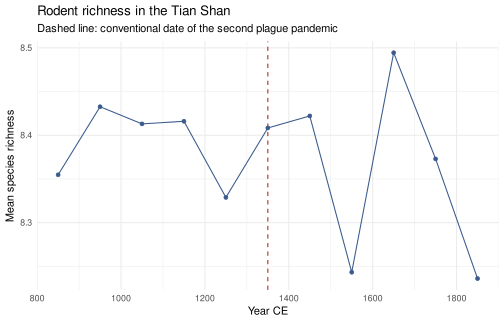
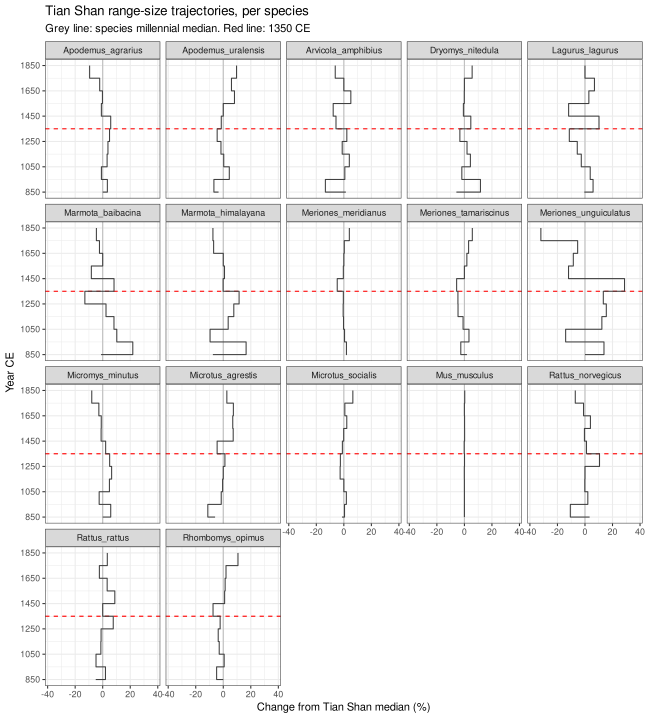
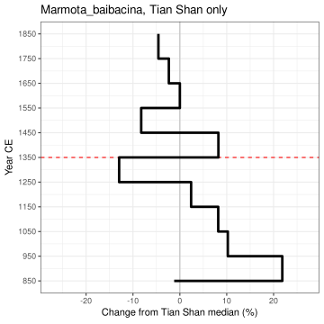
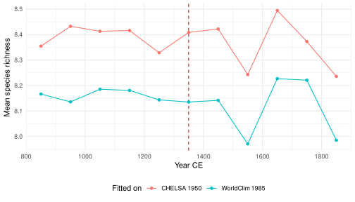

A complete analysis: eleven centuries of rodent distributions across the
Tian Shan, from a global IUCN range download and CHELSA-TraCE21k
palaeoclimate.

The question behind it is epidemiological. The Tian Shan is a plague focus,
and the second pandemic is conventionally dated to the mid-fourteenth century.
If climate reorganised the local rodent assemblage in the run-up to 1350 --
particularly the marmots and gerbils that act as reservoirs -- that
reorganisation is a candidate part of the story. This vignette produces the
distributional evidence; it does not attempt the epidemiology.

**This vignette is precomputed.** It runs against a global Red List download
and roughly 170 MB of prepared climate slices, neither of which can be
redistributed or fetched at build time. The code below is exactly what was
run; see `vignettes/precompute.R`.


``` r
library(richcast)
library(dplyr)
#> 
#> Attaching package: 'dplyr'
#> The following objects are masked from 'package:stats':
#> 
#>     filter, lag
#> The following objects are masked from 'package:base':
#> 
#>     intersect, setdiff, setequal, union
library(ggplot2)
```

## Study design


``` r
VARS <- c("bio01", "bio04", "bio05", "bio06",
          "bio12", "bio15", "bio16", "bio17")
TIMES <- seq(850, 1850, by = 100)

tianshan <- focus_box(c(68, 87, 39, 46), label = "Tian Shan")
karadja  <- focus_box(c(74.38, 74.99, 42.58, 43.03), label = "Karadja")
```

Eight bioclimatic variables: annual mean temperature and its seasonality, the
warmest and coldest month extremes, annual precipitation and its seasonality,
and the wettest and driest quarters. Eleven centennial slices. The wider focus
is the Tian Shan; `karadja` is a 50 km box around the Chüy Valley cemeteries,
carried through as a subregion so site-scale richness is reported alongside
the regional figure.

## Climate

Slices were prepared once, up front: CHELSA-TraCE21k at 0.5 arc-minutes,
aggregated by 20 to land on 10 arc-minutes, for the eleven centennial slices
*and* for the present-day slice the models are fitted against. Sharing one
grid matters -- a model fitted on one grid and projected onto another produces
a plausible-looking surface that means nothing -- and so does sharing one
product, for the reason set out below.


``` r
clim <- prepare_climate(
  path            = "climate/chelsa",
  vars            = VARS,
  times           = TIMES,
  extent          = c(-15, 180, 10, 82),   # Eurasia
  dataset_present = "CHELSA_trace21k_1.0_0.5m_vsi",
  dataset_past    = "CHELSA_trace21k_1.0_0.5m_vsi",
  present_time    = 1950,
  agg_present     = 20,
  agg_past        = 20,
  present_dir     = "chelsa_1950"
)
```


``` r
clim <- climate_dir("../../Baibacina/climate", present = "chelsa_1950")
clim
#> <richcast_climate> <climate_dir>
#> 41 slices: -2150 to 1850 CE

check_climate_grids(clim, VARS)
#> ℹ Ignoring 3 non-slice directories: ".staging", "present_1950", and "present_1985".
#> ✔ 42 slices share one grid (0.1667 x 0.1667 deg).
```

One product throughout, present-day slice included. That matters more than it
looks. `delta_from_present` subtracts a baseline range size from each slice,
so the baseline has to be commensurable with the slices -- and a WorldClim
present sitting beside CHELSA time slices is not. Fitting on WorldClim and
measuring change against it inflated *Marmota baibacina*'s present-day range
by 42% here, which flipped that species from above present in 2 of 11
centuries to above present in all 11. The offset is species-specific in sign
as well as size, so it distorts comparisons between taxa too. See
`?run_hindcast_series` for the `baseline` argument where a single-product
source is not available.

## Taxa

Ranges come from a global Rodentia download from the IUCN Red List spatial
portal. These are **not** redistributed with `richcast` -- the Red List Terms
of Use prohibit it -- so this step needs your own download.

Traits come from `rodent_traits`, bundled from Ecke et al. (2022), which
scores rodent species for synanthropy and zoonotic reservoir status.


``` r
db <- build_taxon_db(
  ranges = iucn_shapefile("../../Inputs/geo_data/iucn_rodentia/data_0.shp"),
  traits = rodent_traits
)
#> ℹ Reading 'data_0.shp'
#> ✔ Reading 'data_0.shp' [1.2s]
#> 
#> ℹ Dissolving 3090 features into 2345 species ranges.
#> ! Spherical union failed on invalid geometry; retrying in planar mode.
#> although coordinates are longitude/latitude, st_union assumes that they are
#> planar
#> ℹ Trait join: 400/2345 species matched, 1945 with NA traits.
#> ! Filtering on a trait column will silently drop the 1945 unmatched species.
```

Note the dissolve. A global Rodentia download stores 3090 features for 2345
species, splitting widespread taxa by subspecies and disjunct patch. Modelling
features rather than species would train each model against a fragment of its
own range while feeding the remainder to the background sample.

`S_index` is the synanthropy score. Every species present in the Ecke table
scores above zero, so filtering on it is really a presence-in-table filter --
worth being explicit about, since it looks like a threshold:


``` r
db <- filter_taxa(db, !is.na(S_index))
#> ℹ Filter kept 248/2345 species (2097 removed).
```

## Running the series

One call. Each species is fitted once against the present-day slice and then
projected onto all eleven slices; species whose ranges fall outside the
buffered focus never get fitted at all. `baseline` is left at its default, so
deltas are measured against that same CHELSA present -- one product from
fitting through to comparison.


``` r
res <- run_hindcast_series(
  db, clim,
  times      = TIMES,
  focus      = tianshan,
  subregions = list(karadja = karadja),
  predictors = VARS,
  resolution = 0.1,
  on_error   = "warn",
  quiet      = TRUE
)
res
#> <richcast_series>
#> 32 species x 11 slices (850-1850 CE)
#> focus: Tian Shan
#> resolvability: ran at min_cells = 100, 0 of 32 held out
#> `$richness` `$species` `$models` `$fits` `$ranges`
```

### Model diagnostics


``` r
res$models |>
  arrange(desc(auc)) |>
  print(n = Inf)
#> # A tibble: 32 × 8
#>    species       auc threshold n_presence n_background range_cells present_cells
#>    <chr>       <dbl>     <dbl>      <int>        <int>       <int>         <int>
#>  1 Sicista_su… 0.989     0.515       1000         1000       12448         13826
#>  2 Allocricet… 0.986     0.504       1000         1000        8431          9005
#>  3 Bandicota_… 0.985     0.515       1000         1000       12841         13981
#>  4 Spermophil… 0.985     0.530       1000         1000        8369          8757
#>  5 Ellobius_t… 0.984     0.525       1000         1000       13946         14814
#>  6 Pteromys_v… 0.977     0.500       1000         1000       82052         83269
#>  7 Arvicola_a… 0.977     0.526       1000         1000       84632         81214
#>  8 Phodopus_s… 0.975     0.484       1000         1000        5964          7480
#>  9 Rattus_tan… 0.974     0.472        669         1000       27313         28997
#> 10 Myopus_sch… 0.972     0.487       1000         1000       62823         67877
#> 11 Lagurus_la… 0.971     0.493       1000         1000       21971         27311
#> 12 Microtus_a… 0.970     0.486       1000         1000       59948         62648
#> 13 Meriones_c… 0.969     0.445       1000         1000       26112         27248
#> 14 Marmota_bo… 0.965     0.512       1000         1000        4058          7388
#> 15 Lasiopodom… 0.962     0.510       1000         1000        3925          5809
#> 16 Marmota_hi… 0.961     0.501       1000         1000        8840         11471
#> 17 Meriones_m… 0.959     0.467       1000         1000       24773         30160
#> 18 Rhombomys_… 0.959     0.449       1000         1000       18855         25328
#> 19 Castor_fib… 0.956     0.530       1000         1000       20997         34926
#> 20 Micromys_m… 0.954     0.530       1000         1000       85573         95981
#> 21 Apodemus_a… 0.953     0.496       1000         1000       53594         73122
#> 22 Cricetulus… 0.951     0.447       1000         1000       16491         25263
#> 23 Apodemus_u… 0.945     0.494       1000         1000       34182         46943
#> 24 Marmota_si… 0.945     0.466       1000         1000        7144          9004
#> 25 Rattus_nor… 0.944     0.468       1000         1000       88015        107498
#> 26 Dryomys_ni… 0.940     0.489       1000         1000       22682         41263
#> 27 Meriones_t… 0.934     0.460       1000         1000       11408         21249
#> 28 Microtus_s… 0.929     0.492       1000         1000        9066         20015
#> 29 Meriones_u… 0.926     0.489       1000         1000       14854         19993
#> 30 Marmota_ba… 0.919     0.490       1000         1000        3161          6296
#> 31 Mus_muscul… 0.919     0.414       1000         1000      212214        192304
#> 32 Rattus_rat… 0.917     0.419       1000         1000       77865        106539
#> # ℹ 1 more variable: resolvable <lgl>
```

AUC here is computed on the training data, so it measures fit rather than
transferability, and should be read as a screen for models that failed rather
than as evidence a model is good. Thresholds come from the default `p10` rule
— the tenth percentile of predictions at training presences — so they cluster
near 0.5 rather than being pushed up by the background, as a TSS-optimised
cutoff would be.

The column to look at before trusting the rest is `range_cells`: how many grid
cells each species' range covers, and so how many distinct climate vectors the
model had to learn from. Presences are drawn with replacement, so `nsample`
cannot exceed it — asking for 1000 samples from a 20-cell range returns each
cell about 50 times, not 1000 observations. `present_cells` is the modelled
present-day range; where it is zero the species contributes nothing to richness
at any slice and its deltas are all zero by construction.


``` r
res$models |>
  filter(!resolvable | present_cells == 0) |>
  arrange(range_cells, present_cells)
#> # A tibble: 0 × 8
#> # ℹ 8 variables: species <chr>, auc <dbl>, threshold <dbl>, n_presence <int>,
#> #   n_background <int>, range_cells <int>, present_cells <int>,
#> #   resolvable <lgl>
```

Nothing is listed. Every one of these 32 species covers at least 3161 cells at
this resolution — the narrowest is *Marmota baibacina* — so all of them clear
`min_cells` comfortably and none produces an empty present-day range. That is
worth stating rather than passing over, because it is exactly why the
resolvability screen was once thought unnecessary: a dataset of wide-ranging
Eurasian rodents cannot exhibit the failure it guards against. See
`?richcast-resolvability` for an assemblage that can.

## Richness over time


``` r
res$richness |>
  select(period, time, mean_richness, max_richness, karadja_max) |>
  print(n = Inf)
#> # A tibble: 12 × 5
#>    period         time mean_richness max_richness karadja_max
#>    <chr>         <dbl>         <dbl>        <dbl>       <dbl>
#>  1 present          NA          8.34           18          15
#>  2 hindcast_850    850          8.35           19          14
#>  3 hindcast_950    950          8.43           19          13
#>  4 hindcast_1050  1050          8.41           19          14
#>  5 hindcast_1150  1150          8.42           20          14
#>  6 hindcast_1250  1250          8.33           20          13
#>  7 hindcast_1350  1350          8.41           21          13
#>  8 hindcast_1450  1450          8.42           20          13
#>  9 hindcast_1550  1550          8.24           18          14
#> 10 hindcast_1650  1650          8.49           19          14
#> 11 hindcast_1750  1750          8.37           19          15
#> 12 hindcast_1850  1850          8.24           18          15
```


``` r
res$richness |>
  filter(period != "present") |>
  ggplot(aes(time, mean_richness)) +
  geom_vline(xintercept = 1350, colour = "firebrick", linetype = "dashed") +
  geom_line(colour = "#3a5a8c") +
  geom_point(colour = "#3a5a8c") +
  labs(
    x = "Year CE", y = "Mean species richness",
    title = "Rodent richness in the Tian Shan",
    subtitle = "Dashed line: conventional date of the second plague pandemic"
  ) +
  theme_minimal()
```



### Where the richness is

A regional mean says how many species, not where. `run_hindcast_series()`
keeps the richness surface for every slice, and `richness_grid()` returns them
in long form for mapping.

Reference geography makes those maps readable: in this region Issyk-Kul,
Balkhash and the Ili and Syr Darya do more to orient a reader than the
graticule does. Countries and coastlines ship with \pkg{rnaturalearth}; lakes
and rivers are downloaded once and cached, and are simply omitted if the
download is unavailable.


``` r
cache <- tools::R_user_dir("richcast", "cache")
dir.create(cache, recursive = TRUE, showWarnings = FALSE)

ne_physical <- function(type) {
  tryCatch(
    rnaturalearth::ne_download(scale = 10, type = type, category = "physical",
                               returnclass = "sf", destdir = cache),
    error = function(e) NULL
  )
}

bb <- sf::st_bbox(tianshan$geometry)

# Natural Earth polygons are valid in the plane but not on the sphere, so sf's
# s2 backend refuses to crop them ("Loop 0 is not valid"). This is the same
# problem richcast handles internally for range polygons. Disable s2 for the
# clip, then put it back.
old_s2 <- sf::sf_use_s2()
suppressMessages(sf::sf_use_s2(FALSE))

clip <- function(x) {
  if (is.null(x)) return(NULL)
  tryCatch(suppressWarnings(sf::st_crop(x, bb)), error = function(e) NULL)
}

borders <- clip(rnaturalearth::ne_countries(scale = "large", returnclass = "sf"))
#> although coordinates are longitude/latitude, st_intersection assumes that they
#> are planar
lakes   <- clip(ne_physical("lakes"))
#> Loading 'ne_10m_lakes.gpkg' from cache...
#> although coordinates are longitude/latitude, st_intersection assumes that they
#> are planar
rivers  <- clip(ne_physical("rivers_lake_centerlines"))
#> Loading 'ne_10m_rivers_lake_centerlines.gpkg' from cache...
#> although coordinates are longitude/latitude, st_intersection assumes that they
#> are planar

suppressMessages(sf::sf_use_s2(old_s2))

vapply(list(borders = borders, lakes = lakes, rivers = rivers),
       function(x) if (is.null(x)) 0L else nrow(x), integer(1))
#> borders   lakes  rivers 
#>       5      10      13
```


``` r
# One specification, reused by every map below.
geo_layers <- function() {
  list(
    if (!is.null(rivers))
      geom_sf(data = rivers, colour = "#6ba3cc", linewidth = 0.22, inherit.aes = FALSE),
    if (!is.null(lakes))
      geom_sf(data = lakes, fill = "#cfe3f2", colour = "#6ba3cc",
              linewidth = 0.18, inherit.aes = FALSE),
    if (!is.null(borders))
      geom_sf(data = borders, fill = NA, colour = "grey30",
              linewidth = 0.28, inherit.aes = FALSE),
    coord_sf(xlim = c(bb[["xmin"]], bb[["xmax"]]),
             ylim = c(bb[["ymin"]], bb[["ymax"]]),
             expand = FALSE, datum = NA),
    scale_fill_distiller(palette = "YlGn", direction = 1, name = "Species"),
    labs(x = NULL, y = NULL),
    theme_minimal(),
    theme(panel.grid = element_blank(),
          panel.background = element_rect(fill = "white", colour = NA),
          axis.text = element_text(size = 7))
  )
}
```


``` r
grid <- richness_grid(res)

ggplot() +
  geom_raster(data = grid, aes(x, y, fill = richness)) +
  geo_layers() +
  facet_wrap(~time, ncol = 3) +
  ggtitle("Rodent richness across the Tian Shan, by century CE") +
  theme(legend.position = "bottom")
```


A single slice against the present-day baseline, on a shared scale:


``` r
pair <- richness_grid(res, times = c("present", "1350")) |>
  mutate(time = factor(time, levels = c("present", "1350"),
                       labels = c("Present", "1350 CE")))

ggplot() +
  geom_raster(data = pair, aes(x, y, fill = richness)) +
  geo_layers() +
  facet_wrap(~time)
```


Individual surfaces come back as `SpatRaster`s, for writing out or for further
`terra` work:


``` r
richness_surface(res, 1350)
#> class       : SpatRaster
#> size        : 70, 190, 1  (nrow, ncol, nlyr)
#> resolution  : 0.1, 0.1  (x, y)
#> extent      : 68, 87, 39, 46  (xmin, xmax, ymin, ymax)
#> coord. ref. : lon/lat WGS 84 (EPSG:4326)
#> source(s)   : memory
#> name        : richness
#> min value   :        0
#> max value   :       21
```

## Species trajectories

`res$species` carries one row per species per slice, with each range expressed
as a suitable-cell count over two different regions, each differenced two ways.

One species across all eleven slices:


``` r
res$species |>
  filter(species == "Marmota_baibacina") |>
  select(time, cells, focus_cells, delta_from_previous, delta_from_present)
#> # A tibble: 11 × 5
#>     time cells focus_cells delta_from_previous delta_from_present
#>    <dbl> <int>       <int>               <int>              <int>
#>  1   850  7262        5224                  NA                966
#>  2   950  7508        6444                 246               1212
#>  3  1050  7224        5829                -284                928
#>  4  1150  6734        5721                -490                438
#>  5  1250  6641        5415                 -93                345
#>  6  1350  6867        4603                 226                571
#>  7  1450  7395        5723                 528               1099
#>  8  1550  8288        4852                 893               1992
#>  9  1650  8371        5288                  83               2075
#> 10  1750  7264        5164               -1107                968
#> 11  1850  9438        5046                2174               3142
```

Both deltas are computed after sorting time numerically. Note the single `NA`
at 850 CE -- the earliest slice has no predecessor, so exactly one row per
species should be missing `delta_from_previous`. Sorting years as text puts
850 and 950 *after* 1850, which moves that `NA` to the wrong row and mis-lags
every difference: the kind of error that survives review because the resulting
table still looks perfectly orderly.


``` r
# One missing lag per species, and it is always the earliest slice.
res$species |>
  summarise(
    species          = dplyr::n_distinct(species),
    missing_lags     = sum(is.na(delta_from_previous)),
    all_at_earliest  = all(time[is.na(delta_from_previous)] == min(time))
  )
#> # A tibble: 1 × 3
#>   species missing_lags all_at_earliest
#>     <int>        <int> <lgl>          
#> 1      32           32 TRUE
```

### Two geographies, and why the trajectories use the second

`cells` is counted over each species' **study extent** -- its own range plus
the fitting buffer -- because that is the region the model was fitted and
projected over. For a widespread Eurasian rodent that is a continental number,
and it moves for continental reasons. The richness curve above is a Tian Shan
number. The two are not the same measurement, and a trajectory drawn from
`cells` beside a richness curve drawn from the focus invites a comparison that
does not hold.

`focus_cells` closes that gap: the same projected range, clipped to the Tian
Shan, on the same grid and with the same `touches` rule the richness surface
uses. It is the column commensurable with `res$richness`.


``` r
occupancy <- res$species |>
  group_by(species) |>
  summarise(
    median_cells       = stats::median(cells),
    median_focus_cells = stats::median(focus_cells),
    ever_in_focus      = max(focus_cells) > 0,
    .groups = "drop"
  ) |>
  arrange(median_focus_cells)

occupancy |> print(n = Inf)
#> # A tibble: 32 × 4
#>    species                   median_cells median_focus_cells ever_in_focus
#>    <chr>                            <int>              <int> <lgl>        
#>  1 Bandicota_bengalensis            13949                  0 FALSE        
#>  2 Lasiopodomys_brandtii             5971                  0 FALSE        
#>  3 Marmota_sibirica                 10536                  0 FALSE        
#>  4 Meriones_crassus                 26188                  0 FALSE        
#>  5 Marmota_bobak                     5511                  8 TRUE         
#>  6 Phodopus_sungorus                 7807                 82 TRUE         
#>  7 Rattus_tanezumi                  30092                433 TRUE         
#>  8 Ellobius_talpinus                12000                536 TRUE         
#>  9 Cricetulus_barabensis            25698                636 TRUE         
#> 10 Pteromys_volans                  83167                670 TRUE         
#> 11 Castor_fiber                     31242                783 TRUE         
#> 12 Allocricetulus_eversmanni         8910                859 TRUE         
#> 13 Spermophilus_pygmaeus             6804                883 TRUE         
#> 14 Sicista_subtilis                 13539                890 TRUE         
#> 15 Meriones_unguiculatus            20463               1239 TRUE         
#> 16 Myopus_schisticolor              60964               1339 TRUE         
#> 17 Microtus_agrestis                57491               2425 TRUE         
#> 18 Marmota_himalayana               11215               2941 TRUE         
#> 19 Rattus_rattus                   101071               2989 TRUE         
#> 20 Apodemus_agrarius                72305               3747 TRUE         
#> 21 Micromys_minutus                 91659               3826 TRUE         
#> 22 Arvicola_amphibius               73885               4566 TRUE         
#> 23 Lagurus_lagurus                  28951               4967 TRUE         
#> 24 Marmota_baibacina                 7264               5288 TRUE         
#> 25 Rattus_norvegicus                99946               6249 TRUE         
#> 26 Microtus_socialis                17212               7214 TRUE         
#> 27 Apodemus_uralensis               50160               7470 TRUE         
#> 28 Rhombomys_opimus                 23040               7929 TRUE         
#> 29 Meriones_tamariscinus            17632               9323 TRUE         
#> 30 Dryomys_nitedula                 47428               9506 TRUE         
#> 31 Meriones_meridianus              27830              11056 TRUE         
#> 32 Mus_musculus                    188240              13204 TRUE
```

Two things fall out of that table.

**Some species are not here at all.** Species are chosen by intersecting the
focus expanded by `prefilter_buffer` -- eight degrees, which stretches the box
to 60-95 degrees E and 31-54 degrees N -- so the run legitimately includes taxa
that approach the Tian Shan without entering it. Four of the 32 have zero
suitable cells inside the focus at every slice. They are real model output and
they belong in `res$species`; they do not belong in a figure about this region,
and before `focus_cells` existed there was nothing in the table to reveal that.


``` r
occupancy |> filter(!ever_in_focus)
#> # A tibble: 4 × 4
#>   species               median_cells median_focus_cells ever_in_focus
#>   <chr>                        <int>              <int> <lgl>        
#> 1 Bandicota_bengalensis        13949                  0 FALSE        
#> 2 Lasiopodomys_brandtii         5971                  0 FALSE        
#> 3 Marmota_sibirica             10536                  0 FALSE        
#> 4 Meriones_crassus             26188                  0 FALSE
```

**The two counts are not on the same grid.** `cells` is counted on the climate
grid, `focus_cells` on the 0.1-degree grid the richness surface is built at,
so their ratio is not a fraction of range inside the focus. Compare each column
against itself across slices, where the grid cancels; use area to compare one
against the other.

To compare species with very different range sizes, put each trajectory in
units of its own standard deviation. Note that this divides by the SD without
subtracting the mean: `scale()` would do both, which moves zero to *average
change across the series* while it still looks like *no change from present* --
and if most slices were smaller than today, every taxon then appears to sit a
full standard deviation above the line for purely arithmetic reasons.

### Which species can carry a regional trajectory

`focus_cells` says how much of the Tian Shan a species holds. It does not say
whether holding it means anything. A projected range is a threshold applied to
a continuous surface: where the region sits well inside a species' modelled
niche the cell count moves when the climate moves, and where it sits *at* the
cutoff the count moves when anything does. Both produce plausible numbers that
change between slices, and `focus_cells` alone cannot tell them apart.

`focus_suit_margin` can. It is the ninetieth percentile of suitability inside
the focus, less that species' own threshold, so a negative value means the
region does not clear the cutoff even at its ninetieth percentile.


``` r
# How many grid cells the focus holds, so occupancy can be read as a share of
# the region rather than as a bare count.
focus_n <- res$richness$cells[1]

niche <- res$species |>
  group_by(species) |>
  summarise(
    median_focus_cells = stats::median(focus_cells),
    worst_margin       = round(min(focus_suit_margin), 3),
    best_pct_of_focus  = round(100 * max(focus_cells) / focus_n, 1),
    .groups = "drop"
  ) |>
  filter(median_focus_cells >= 100) |>
  arrange(worst_margin)

niche |> print(n = Inf)
#> # A tibble: 26 × 4
#>    species                   median_focus_cells worst_margin best_pct_of_focus
#>    <chr>                                  <int>        <dbl>             <dbl>
#>  1 Sicista_subtilis                         890       -0.245               7.5
#>  2 Allocricetulus_eversmanni                859       -0.207               9  
#>  3 Rattus_tanezumi                          433       -0.195               4.4
#>  4 Castor_fiber                             783       -0.19                6.9
#>  5 Pteromys_volans                          670       -0.18                7  
#>  6 Ellobius_talpinus                        536       -0.154              10.7
#>  7 Myopus_schisticolor                     1339       -0.146              11.9
#>  8 Cricetulus_barabensis                    636       -0.09                6.4
#>  9 Spermophilus_pygmaeus                    883       -0.012               9.5
#> 10 Microtus_agrestis                       2425        0.032              19.6
#> 11 Meriones_unguiculatus                   1239        0.065              12  
#> 12 Marmota_himalayana                      2941        0.083              25.8
#> 13 Rattus_norvegicus                       6249        0.097              51.9
#> 14 Rattus_rattus                           2989        0.114              24.5
#> 15 Micromys_minutus                        3826        0.124              30.6
#> 16 Arvicola_amphibius                      4566        0.149              36.1
#> 17 Apodemus_agrarius                       3747        0.159              29.8
#> 18 Marmota_baibacina                       5288        0.177              48.5
#> 19 Lagurus_lagurus                         4967        0.224              41.2
#> 20 Microtus_socialis                       7214        0.235              57.8
#> 21 Apodemus_uralensis                      7470        0.264              61.6
#> 22 Meriones_tamariscinus                   9323        0.281              74.1
#> 23 Dryomys_nitedula                        9506        0.282              79.8
#> 24 Rhombomys_opimus                        7929        0.295              66  
#> 25 Meriones_meridianus                    11056        0.314              86.5
#> 26 Mus_musculus                           13204        0.403              99.5
```

Nine of the 26 come out negative, holding between 0.4% and 17% of the region
at their best slice. They are edge populations, and a percent change computed
on an edge is a statement about the threshold.


``` r
traj <- res$species |>
  group_by(species) |>
  filter(min(focus_suit_margin) > 0) |>
  mutate(ref = stats::median(focus_cells),
         pct = 100 * (focus_cells - ref) / ref) |>
  ungroup() |>
  filter(ref > 0)

# Reservoir hosts for plague in this region, from the literature rather than
# from anything computed here.
RESERVOIRS <- c("Marmota_baibacina", "Marmota_himalayana",
                "Meriones_meridianus", "Lagurus_lagurus", "Rhombomys_opimus")

# Net change across the series, measured two ways. `endpoint` is the youngest
# slice against the oldest; `robust` compares the median of the three oldest
# slices with the median of the three youngest, so a single flickering century
# at either end cannot set the answer. Where they disagree, the endpoint
# version is the one leaning on one slice.
growth <- traj |>
  group_by(species) |>
  arrange(time, .by_group = TRUE) |>
  summarise(
    endpoint = 100 * (dplyr::last(focus_cells) - dplyr::first(focus_cells)) /
      dplyr::first(focus_cells),
    robust   = 100 * (stats::median(utils::tail(focus_cells, 3)) -
                        stats::median(utils::head(focus_cells, 3))) /
      stats::median(utils::head(focus_cells, 3)),
    .groups  = "drop"
  ) |>
  mutate(reservoir = species %in% RESERVOIRS) |>
  arrange(desc(robust))

growth |> print(n = Inf)
#> # A tibble: 17 × 4
#>    species               endpoint  robust reservoir
#>    <chr>                    <dbl>   <dbl> <lgl>    
#>  1 Microtus_agrestis       9.07    13.6   FALSE    
#>  2 Apodemus_uralensis     13.5     12.0   FALSE    
#>  3 Rattus_rattus           8.84     8.51  FALSE    
#>  4 Rhombomys_opimus       10.7      1.99  TRUE     
#>  5 Dryomys_nitedula       12.2      1.91  FALSE    
#>  6 Microtus_socialis       7.99     1.63  FALSE    
#>  7 Meriones_tamariscinus   3.83     1.18  FALSE    
#>  8 Marmota_himalayana      0.0368   0.588 TRUE     
#>  9 Mus_musculus            0.242    0.121 FALSE    
#> 10 Arvicola_amphibius     -7.60    -0.718 FALSE    
#> 11 Lagurus_lagurus         0.465   -0.950 TRUE     
#> 12 Meriones_meridianus     1.69    -1.54  TRUE     
#> 13 Apodemus_agrarius      -9.50    -2.19  FALSE    
#> 14 Micromys_minutus       -7.95    -2.80  FALSE    
#> 15 Rattus_norvegicus     -10.1     -3.04  FALSE    
#> 16 Meriones_unguiculatus -32.0     -8.47  FALSE    
#> 17 Marmota_baibacina      -3.41   -11.4   TRUE
```

The panels below are drawn in one colour. An earlier version coloured the
upper tenth by net growth, which was a mistake twice over. It ranked on the
endpoint measure, so it marked species whose first or last century happened to
sit high -- *Dryomys nitedula* was coloured as a top grower at +12.2% endpoint
against +1.9% robust. And before the niche screen the ranking was led by
species with a marginal regional presence, because a small sliver moves
proportionally most: *Castor fiber* topped it while holding 2-5% of the Tian
Shan above its own threshold. With those two faults fixed the surviving
assemblage spans about 25 percentage points end to end, which is too narrow a
range for a decile cut to mean anything. The ranking is left in the table,
where its size is visible, rather than drawn on the figure, where it would
read as expansion.

Reservoir status is likewise a property of the literature and stays in the
table, so whether it coincides with anything is read off the numbers rather
than assumed by the figure's construction.

Three choices here are worth spelling out.

**Measured in the focus, not over the whole range.** An earlier version of this
figure plotted `cells`, the study-extent count. That put four species on the
page that never enter the Tian Shan, and made every remaining panel a
continental trajectory labelled as a regional one. It also changed the answer,
not just the framing: on `cells`, *Marmota baibacina* leads the series at +30%
net growth and is the headline of the reservoir argument; on `focus_cells` it
is the largest regional decliner of the screened set, its expansion having
happened outside the Tian Shan. Any claim tied to this region has to be made
on the regional column.

**Percent change, not standard deviations.** An earlier version divided each
delta by the standard deviation of that species' own deltas across the eleven
slices. That is a bad denominator: it measures how much a trajectory *wanders*,
not how uncertain any point on it is, so it shrinks as a species becomes more
stable and awards its largest scores to the species that changed least.
*Castor fiber* read as four SD below present when its range was in fact 6%
smaller. For a denominator that means something, see the replicate section
below.

**Referenced to each species' own median, not to a particular slice.** Three
candidates were considered and the first two rejected on evidence.

The *present-day slice* is in-sample: models are fitted on that raster, and
`p10` sets the threshold so about 90% of training presences pass on it, while
every hindcast slice is an extrapolation. Both push projections downward
against it. Across six species the 1850 range averaged 96% of present and five
of six never exceeded present at any slice -- a real offset of a few percent,
but an artefact of the comparison rather than a signal.

The *1850 slice* removes that asymmetry, since both sides are then
out-of-sample, but it is an endpoint extreme in its own right: over the Tian
Shan it is the warmest of the eleven centuries (bio01 and bio05 both rank
11/11) and the driest (bio12, bio15 and bio16 all rank 1/11). Referencing to it
compares every century against the most anomalous one.

The *median* is subject to neither. Zero means "typical for this species across
the millennium", so the axis reads as departure from a species' own norm. The
cost is that zero is internal to the series and no longer says anything about
the present day; `res$species` retains `delta_from_present` for that.

Time runs down the vertical axis, as in a stratigraphic column, so a century
reads as a level rather than a position along a line. Each panel is one
species; the grey vertical rule is that species' own median, the red horizontal
rule is 1350 CE. Steps rather than lines, because a centennial slice is an
interval, not an instant.

The axis is set from the data rather than to a round number: the largest
fluctuation in the series, plus five percentage points of margin. That keeps
the scale tight enough to read while guaranteeing nothing is pushed off the
panel -- a fixed window would have hidden whichever species happened to move
most, which is exactly the species worth seeing.

What that rule produces depends entirely on the screen in front of it. Without
the niche screen the axis runs to 170, set by *Ellobius talpinus* alone, whose
Tian Shan footprint goes 2, 1221, 260, 120, 1418 cells across consecutive
slices while its range-wide count barely moves: the region sits below its
threshold at every slice, so the trajectory is the cutoff flickering rather
than a range responding. With the screen the axis is 38 and every panel is
legible.

That is the argument for screening on the niche rather than on how much a
series jumps. A fold-change screen on `focus_cells` would have removed
*Ellobius* -- it spans 709-fold -- but it catches only three of the nine
negative-margin species, because a footprint can stay small without swinging.
*Castor fiber* varies by less than two-fold and holds 2-5% of the region above
its threshold; volatility passes it, the niche screen does not.

What survives is an assemblage that is regionally stable. Nothing moves more
than about 33% from its own millennial median, and the reservoir species move
least of all.


``` r
traj_lim <- ceiling(max(abs(traj$pct), na.rm = TRUE)) + 5

traj |>
  summarise(
    points        = dplyr::n(),
    worst_species = species[which.max(abs(pct))],
    worst_pct     = round(max(abs(pct)), 1),
    axis_limit    = traj_lim
  )
#> # A tibble: 1 × 4
#>   points worst_species         worst_pct axis_limit
#>    <int> <chr>                     <dbl>      <dbl>
#> 1    187 Meriones_unguiculatus        32         38
```


``` r
ggplot(traj, aes(y = time, x = pct, group = species)) +
  geom_vline(xintercept = 0, colour = "gray") +
  geom_hline(yintercept = 1350, colour = "red", linetype = "dashed") +
  geom_step(orientation = "y", colour = "grey25") +
  scale_y_continuous(breaks = seq(850, 1850, by = 200)) +
  facet_wrap(~species, ncol = 5) +
  coord_cartesian(xlim = c(-traj_lim, traj_lim)) +
  labs(x = "Change from Tian Shan median (%)", y = "Year CE",
       title = "Tian Shan range-size trajectories, per species",
       subtitle = "Grey line: species millennial median. Red line: 1350 CE") +
  theme_bw()
```



A single species at readable size, with every slice labelled. The shared axis
exists so panels can be compared with each other; one species on its own has
nothing to be compared against, so this figure takes its own limit rather than
inheriting a scale set by *Ellobius*.


``` r
one_sp <- traj |> filter(species == "Marmota_baibacina")
one_lim <- ceiling(max(abs(one_sp$pct), na.rm = TRUE)) + 5

ggplot(one_sp, aes(y = time, x = pct)) +
  geom_vline(xintercept = 0, colour = "gray") +
  geom_hline(yintercept = 1350, colour = "red", linetype = "dashed") +
  geom_step(orientation = "y", linewidth = 1.3) +
  scale_y_continuous(breaks = seq(850, 1850, by = 100)) +
  coord_cartesian(xlim = c(-one_lim, one_lim)) +
  labs(x = "Change from Tian Shan median (%)", y = "Year CE") +
  ggtitle("Marmota_baibacina, Tian Shan only") +
  theme_bw()
```



## Does the fitting dataset matter?

The run above stays inside CHELSA-TraCE21k. The obvious alternative is to fit
on WorldClim, an observational product, and project onto CHELSA -- which is
what the pipeline this package was extracted from did. That crosses products
between fitting and projection, so any systematic difference between the two
is folded into what looks like climate change:


``` r
clim_worldclim <- climate_dir("../../Inputs/Climate/eurasia_slices")

res_worldclim <- run_hindcast_series(
  db, clim_worldclim,
  times = TIMES, focus = tianshan,
  subregions = list(karadja = karadja),
  predictors = VARS, resolution = 0.1,
  on_error = "warn", quiet = TRUE
)
```


``` r
comparison <- inner_join(
  res$richness           |> filter(period != "present") |> select(time, chelsa_fit    = mean_richness),
  res_worldclim$richness |> filter(period != "present") |> select(time, worldclim_fit = mean_richness),
  by = "time"
)
comparison |> mutate(difference = chelsa_fit - worldclim_fit)
#> # A tibble: 11 × 4
#>     time chelsa_fit worldclim_fit difference
#>    <dbl>      <dbl>         <dbl>      <dbl>
#>  1   850       8.35          8.17      0.188
#>  2   950       8.43          8.14      0.296
#>  3  1050       8.41          8.19      0.227
#>  4  1150       8.42          8.18      0.235
#>  5  1250       8.33          8.14      0.185
#>  6  1350       8.41          8.14      0.273
#>  7  1450       8.42          8.14      0.280
#>  8  1550       8.24          7.97      0.272
#>  9  1650       8.49          8.23      0.267
#> 10  1750       8.37          8.22      0.152
#> 11  1850       8.24          7.99      0.250
```


``` r
bind_rows(
  transmute(comparison, time, fitted_on = "WorldClim 1985", mean_richness = worldclim_fit),
  transmute(comparison, time, fitted_on = "CHELSA 1950",    mean_richness = chelsa_fit)
) |>
  ggplot(aes(time, mean_richness, colour = fitted_on)) +
  geom_vline(xintercept = 1350, colour = "firebrick", linetype = "dashed") +
  geom_line() +
  geom_point() +
  labs(x = "Year CE", y = "Mean species richness", colour = "Fitted on") +
  theme_minimal() +
  theme(legend.position = "bottom")
```



The two runs achieve near-identical fit quality, and disagree anyway:


``` r
tibble::tibble(
  fitted_on     = c("CHELSA 1950", "WorldClim 1985"),
  median_auc    = c(median(res$models$auc), median(res_worldclim$models$auc)),
  zero_range_sp = c(sum(res$models$present_cells == 0),
                    sum(res_worldclim$models$present_cells == 0))
)
#> # A tibble: 2 × 3
#>   fitted_on      median_auc zero_range_sp
#>   <chr>               <dbl>         <int>
#> 1 CHELSA 1950         0.960             0
#> 2 WorldClim 1985      0.955             0

cor(comparison$worldclim_fit, comparison$chelsa_fit)
#> [1] 0.8415259
```

This is worth taking seriously rather than picking a winner. Median AUC is
essentially the same either way, so goodness of fit gives no basis for
preferring one. But the two series correlate only moderately, and they do not
agree on which century is the minimum. Any claim of the form "richness bottomed
out at *x*" is therefore a claim about the fitting dataset as much as about the
past, and should be reported as conditional on it.

Staying within CHELSA has the cleaner logic -- no product change between
fitting and projection, so `delta_from_present` compares like with like. Its
present-day slice is itself modelled, though, so it carries the
reconstruction's biases rather than an observational network's. That is a real
cost, but a smaller one than an incommensurable baseline: a modelled present
is biased, whereas a cross-product present is biased *differently for each
species*.

Running both is cheap once the slices are on disk, and the spread between them
is a more honest error bar than either run's internal statistics.

## A standardised axis, done properly

Percent change is interpretable but not comparable across species with very
different range sizes. If a standardised axis is wanted, the denominator has to
be *measurement uncertainty*, which `replicates` supplies: each replicate
redraws the presence and background samples and re-optimises the threshold, so
the spread across replicates is how much the answer moves when the sample
moves.

Replicating all 32 species is expensive, so this is one species. `cells_sd` is
the standard deviation of that species' suitable-cell count across replicates.
This section stays on the study-extent column: replicates measure how much
redrawing the sample moves the fitted model, which is a property of the fit
over the region it was fitted on, not of the Tian Shan clip of it.


``` r
one <- run_hindcast_series(
  db |> filter_taxa(species == "Marmota_baibacina", quiet = TRUE),
  clim,
  times      = TIMES,
  focus      = tianshan,
  predictors = VARS,
  resolution = 0.1,
  replicates = 10,
  quiet      = TRUE
)

one$species |>
  transmute(
    time,
    cells,
    pct      = round(100 * delta_from_present / present_cells, 1),
    cells_sd = round(cells_sd, 1),
    z_meas   = round(delta_from_present / cells_sd, 1)
  ) |>
  print(n = Inf)
#> # A tibble: 11 × 5
#>     time cells   pct cells_sd z_meas
#>    <dbl> <dbl> <dbl>    <dbl>  <dbl>
#>  1   850 6908.   9.7     651.    0.9
#>  2   950 7567   20.2     468.    2.7
#>  3  1050 7105   12.8     569.    1.4
#>  4  1150 6818    8.3     430.    1.2
#>  5  1250 6558    4.2     436.    0.6
#>  6  1350 6742.   7.1     551.    0.8
#>  7  1450 7382   17.2     541.    2  
#>  8  1550 8248.  31       613.    3.2
#>  9  1650 8444.  34.1     474.    4.5
#> 10  1750 7234.  14.9     406.    2.3
#> 11  1850 9888.  57       661.    5.4
```

The two standardised columns answer different questions. `pct` is the size of
the change; `z_meas` is whether the change exceeds what redrawing the sample
would produce anyway. A change of a few percent that is many measurement SDs
wide is a real shift in a tightly estimated range; the same few percent inside
one measurement SD is not distinguishable from sampling noise.

Contrast this with dividing by the spread of the deltas themselves, which is
what the figures above once did. That denominator gets *smaller* the more
stable a trajectory is, so it awards its largest scores to the species that
changed least -- the opposite of what a standardised effect should do.

## Chronological uncertainty

Assigning an assemblage to a single century is usually more precision than the
dating supports. `gaussian_window()` averages a window of slices around each
target, weighted toward the centre, so a projection reflects a period rather
than a year:


``` r
res_smoothed <- run_hindcast_series(
  db, clim,
  times      = TIMES,
  focus      = tianshan,
  subregions = list(karadja = karadja),
  predictors = VARS,
  window     = gaussian_window(step = 100, weights = c(0.1, 0.3, 1, 0.3, 0.1)),
  quiet      = TRUE
)
```

The cost is a fivefold increase in raster reads, which is why it is opt-in.

## Reproducing this


``` r
sessionInfo()
#> R version 4.6.1 (2026-06-24)
#> Platform: x86_64-pc-linux-gnu
#> Running under: Ubuntu 24.04.4 LTS
#> 
#> Matrix products: default
#> BLAS:   /usr/lib/x86_64-linux-gnu/openblas-pthread/libblas.so.3 
#> LAPACK: /usr/lib/x86_64-linux-gnu/openblas-pthread/libopenblasp-r0.3.26.so;  LAPACK version 3.12.0
#> 
#> locale:
#>  [1] LC_CTYPE=en_US.UTF-8       LC_NUMERIC=C              
#>  [3] LC_TIME=en_US.UTF-8        LC_COLLATE=en_US.UTF-8    
#>  [5] LC_MONETARY=en_US.UTF-8    LC_MESSAGES=en_US.UTF-8   
#>  [7] LC_PAPER=en_US.UTF-8       LC_NAME=C                 
#>  [9] LC_ADDRESS=C               LC_TELEPHONE=C            
#> [11] LC_MEASUREMENT=en_US.UTF-8 LC_IDENTIFICATION=C       
#> 
#> time zone: Asia/Jerusalem
#> tzcode source: system (glibc)
#> 
#> attached base packages:
#> [1] stats     graphics  grDevices utils     datasets  methods   base     
#> 
#> other attached packages:
#> [1] ggplot2_4.0.3       dplyr_1.2.1         richcast_0.0.0.9000
#> [4] testthat_3.3.2     
#> 
#> loaded via a namespace (and not attached):
#>  [1] gtable_0.3.6                  shape_1.4.6.1                
#>  [3] bayestestR_0.18.1             xfun_0.60                    
#>  [5] devtools_2.5.2                insight_1.5.2                
#>  [7] maxnet_0.1.4                  lattice_0.23-1               
#>  [9] vctrs_0.7.3                   tools_4.6.1                  
#> [11] generics_0.1.4                datawizard_1.3.1             
#> [13] tibble_3.3.1                  proxy_0.4-29                 
#> [15] pkgconfig_2.0.3               Matrix_1.7-6                 
#> [17] KernSmooth_2.23-27            RColorBrewer_1.1-3           
#> [19] S7_0.2.2                      desc_1.4.3                   
#> [21] lifecycle_1.0.5               compiler_4.6.1               
#> [23] farver_2.1.2                  brio_1.1.5                   
#> [25] terra_1.9-34                  codetools_0.2-20             
#> [27] usethis_3.2.1                 class_7.3-24                 
#> [29] glmnet_5.0                    modEvA_3.45                  
#> [31] pillar_1.11.1                 ellipsis_0.3.3               
#> [33] classInt_0.4-11               cachem_1.1.0                 
#> [35] wk_0.9.5                      sessioninfo_1.2.4            
#> [37] iterators_1.0.14              foreach_1.5.2                
#> [39] rnaturalearthdata_1.0.0.9000  tidyselect_1.2.1             
#> [41] sf_1.1-2                      purrr_1.2.2                  
#> [43] labeling_0.4.3                splines_4.6.1                
#> [45] rprojroot_2.1.1               fastmap_1.2.0                
#> [47] rnaturalearth_1.2.0           grid_4.6.1                   
#> [49] cli_3.6.6                     magrittr_2.0.5               
#> [51] utf8_1.2.6                    survival_3.8-9               
#> [53] pkgbuild_1.4.8                e1071_1.7-17                 
#> [55] withr_3.0.2                   scales_1.4.0                 
#> [57] otel_0.2.0                    rnaturalearthhires_1.0.0.9000
#> [59] memoise_2.0.1                 evaluate_1.0.5               
#> [61] knitr_1.51                    parameters_0.29.2            
#> [63] s2_1.1.11                     rlang_1.2.0                  
#> [65] Rcpp_1.1.2                    glue_1.8.1                   
#> [67] DBI_1.3.0                     pkgload_1.5.3                
#> [69] effectsize_1.0.3              rstudioapi_0.18.0            
#> [71] R6_2.6.1                      fs_2.1.0                     
#> [73] units_1.0-1
```

## Data sources

* **Ranges** -- IUCN Red List of Threatened Species, spatial data download,
  Rodentia. <https://www.iucnredlist.org>. Not redistributed; cite the version
  you download.
* **Traits** -- Ecke et al. (2022) *Nature Communications* **13**:7532,
  Supplementary Data 1. CC BY 4.0.
* **Present climate** -- WorldClim 2.1, 5 arc-minutes.
* **Palaeoclimate** -- CHELSA-TraCE21k v1.0, 0.5 arc-minutes, via `pastclim`.
